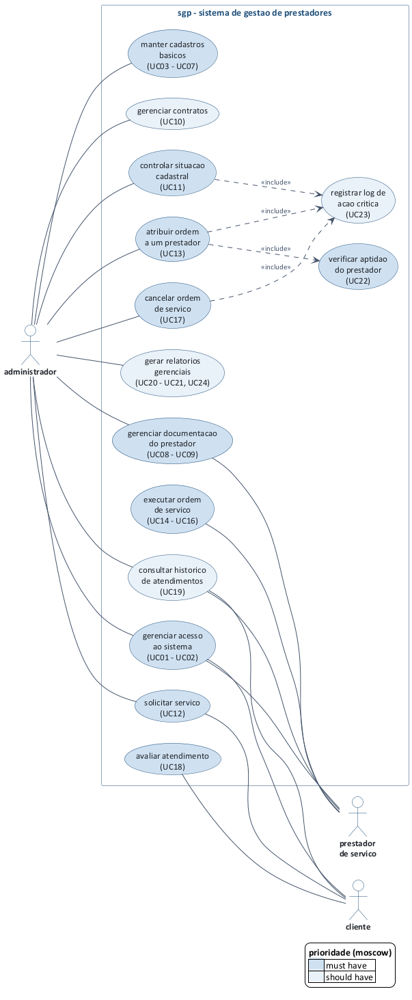
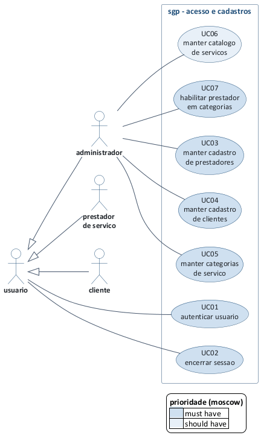
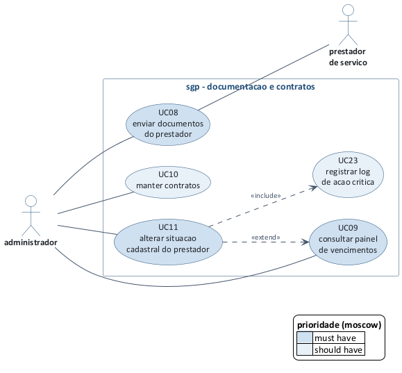
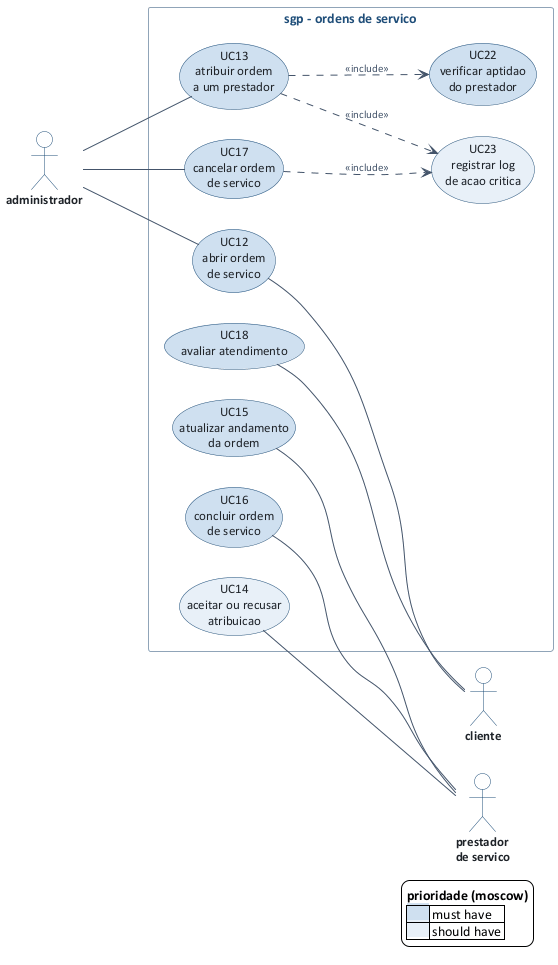
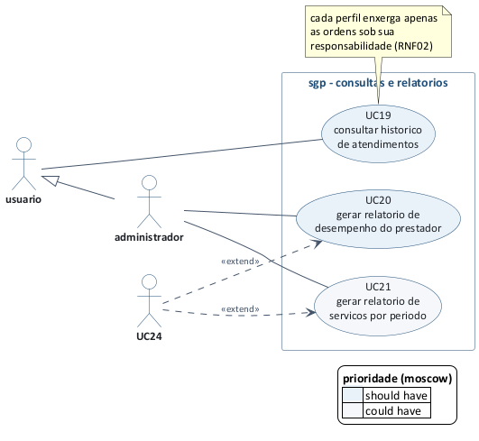

# sgp - sistema de gestao de prestadores
## documento de casos de uso, historias de usuario e priorizacao

**versao 1.0 - 21/08/2026 - 2ª entrega**
unicesumar - analise e desenvolvimento de sistemas
imersao profissional - projeto de software - equipe 8

---

## 1. identificacao do documento

| item | descricao |
|---|---|
| sistema | sgp - sistema de gestao de prestadores |
| documento | casos de uso, historias de usuario e priorizacao de escopo |
| entrega | 2ª entrega - modelagem |
| equipe | equipe 8 |
| integrantes | luis gustavo boratto de oliveira, igor schiniegoski pallisser |
| documento de origem | [documento-visao-requisitos.md](documento-visao-requisitos.md) - versao 1.0 |
| notacao | uml 2.5 - diagrama de casos de uso |
| ferramenta | plantuml (fonte `.puml` versionado junto com a imagem gerada) |

### 1.1 objetivo deste documento

este documento traduz os requisitos funcionais levantados na 1ª entrega em casos de uso, especifica o comportamento esperado do sistema em cada um deles e define a ordem em que serao construidos. ele serve a tres propositos:

1. **modelar** o comportamento externo do sgp, ou seja, o que cada perfil consegue fazer com o sistema, sem entrar em decisao de implementacao;
2. **detalhar** cada caso de uso com pre-condicões, fluxo principal, fluxos alternativos, excecões e pos-condicões, de forma que o mesmo texto sirva de base tanto para a construcao das telas quanto para o roteiro de teste;
3. **priorizar** o escopo com a tecnica moscow, deixando explicito o que entra no mvp e o que fica para as entregas seguintes, ja que o prazo da disciplina nao comporta os 19 requisitos funcionais de uma vez.

### 1.2 relacao com os demais documentos

```
documento de visao e requisitos (1a entrega)
        |
        +--> RF01..RF19  ---------> casos de uso UC01..UC24  (este documento, secao 7)
        +--> RN01..RN12  ---------> regras citadas em cada caso de uso
        +--> RNF01..RNF11 --------> criterios de aceite das historias (secao 8)
                                            |
                                            +--> diagramas de atividade e modelo de dados (2a entrega)
                                            +--> prototipo de telas (3a entrega)
```

---

## 2. atores do sistema

ator é qualquer papel externo que interage com o sgp. o sistema tem tres atores concretos, todos humanos, e um ator generalizado que existe apenas para fatorar o comportamento comum aos tres.

| ator | tipo | descricao | casos de uso que inicia |
|---|---|---|---|
| **usuario** | generalizado (abstrato) | papel abstrato que reune o que qualquer pessoa autenticada faz, independente do perfil. nao é atribuido a ninguem diretamente | UC01, UC02, UC19 |
| **administrador** | primario | gestor da empresa contratante. responde pela rede de prestadores, pela conferencia da documentacao e pela distribuicao das demandas | UC03 a UC13, UC17, UC20, UC21, UC24 |
| **prestador de servico** | primario | profissional autonomo, mei ou empresa contratada. executa os servicos e mantem a propria documentacao em dia | UC08, UC14, UC15, UC16 |
| **cliente** | primario | quem solicita o servico e recebe o atendimento. pode ser um setor interno da empresa ou um cliente externo | UC12, UC18 |

### 2.1 generalizacao de atores

administrador, prestador e cliente **herdam** de usuario. na pratica isso significa que os tres autenticam, encerram sessao e consultam historico pelas mesmas telas, mudando apenas o recorte de dados que cada um enxerga, o que é garantido no servidor conforme o RNF02.

```
                 usuario
                    ^
        ------------+------------
        |           |           |
  administrador  prestador   cliente
```

### 2.2 atores fora do escopo desta versao

nao existe ator sistema nem ator tempo no modelo. o painel de vencimentos (UC09) é uma consulta feita sob demanda pelo administrador, e nao uma rotina automatica disparada por agendador. o disparo automatico de aviso por email ou whatsapp foi classificado como *wont have* (secao 6.3) e, quando entrar, vai introduzir um ator tempo no diagrama.

---

## 3. diagrama de casos de uso - visao geral

o diagrama abaixo apresenta a visao macro do sistema. para caber em uma pagina e continuar legivel, os casos de uso foram agrupados por afinidade funcional, e o intervalo de codigos entre parenteses indica quais casos de uso detalhados cada elipse representa. os diagramas por modulo da secao 4 abrem cada um desses agrupamentos.



*fonte: elaborado pela equipe. arquivo fonte em [diagramas/caso-de-uso-geral.puml](../diagramas/caso-de-uso-geral.puml)*

o preenchimento das elipses indica a prioridade moscow definida na secao 6: azul mais escuro para *must have*, azul claro para *should have* e branco para *could have*.

---

## 4. diagramas de casos de uso por modulo

### 4.1 acesso e cadastros



reune a autenticacao e os cadastros de apoio. é o modulo que precisa existir antes de qualquer outro, porque sem categoria, servico e prestador cadastrados nao é possivel abrir nem atribuir uma ordem.

### 4.2 documentacao e contratos



trata do ciclo de vida documental do prestador. o relacionamento `<<extend>>` entre UC11 e UC09 representa que, ao consultar o painel de vencimentos, o administrador pode opcionalmente alterar ali mesmo a situacao cadastral do prestador que aparece com documento vencido, sem precisar navegar ate o cadastro dele.

### 4.3 ordens de servico



é o nucleo do sistema e concentra o fluxo que vai da solicitacao do cliente ate a conclusao pelo prestador. UC13 inclui obrigatoriamente UC22, porque nenhuma atribuicao pode ocorrer sem antes verificar se o prestador esta apto (RN01 a RN04).

### 4.4 consultas e relatorios



consolida o que ja foi registrado. UC19 é o unico caso de uso deste modulo acessivel aos tres perfis, sempre com o recorte de dados do perfil logado.

### 4.5 relacionamentos usados no modelo

| relacionamento | onde aparece | por que |
|---|---|---|
| `<<include>>` | UC13 → UC22 | toda atribuicao verifica a aptidao do prestador. o comportamento é obrigatorio e sempre executado |
| `<<include>>` | UC11, UC13, UC17 → UC23 | as tres acões sao criticas e o RF19 exige registro em log em todas elas |
| `<<extend>>` | UC11 → UC09 | comportamento opcional: a partir do painel de vencimentos o administrador pode bloquear o prestador. ponto de extensao "prestador com documento vencido" |
| `<<extend>>` | UC24 → UC20, UC21 | a exportacao é opcional e so faz sentido depois que o relatorio ja foi gerado na tela |
| generalizacao | usuario ← administrador, prestador, cliente | evita repetir UC01, UC02 e UC19 ligados aos tres atores |

---

## 5. quadro geral dos casos de uso

| codigo | caso de uso | ator principal | ator secundario | RF de origem | regras aplicaveis | prioridade |
|---|---|---|---|---|---|---|
| UC01 | autenticar usuario | usuario | - | RF01 | RNF01, RNF02 | must have |
| UC02 | encerrar sessao | usuario | - | derivado do RNF03 | RNF03 | must have |
| UC03 | manter cadastro de prestadores | administrador | - | RF02 | RN10, RN11 | must have |
| UC04 | manter cadastro de clientes | administrador | - | RF03 | RN10 | must have |
| UC05 | manter categorias de servico | administrador | - | RF04 | - | must have |
| UC06 | manter catalogo de servicos | administrador | - | RF05 | - | must have |
| UC07 | habilitar prestador em categorias | administrador | - | RF06 | RN04 | must have |
| UC08 | enviar documentos do prestador | prestador | administrador | RF07 | RN02, RNF09 | must have |
| UC09 | consultar painel de vencimentos | administrador | - | RF08 | RN02 | must have |
| UC10 | manter contratos | administrador | - | RF10 | RN03, RNF09 | should have |
| UC11 | alterar situacao cadastral do prestador | administrador | - | RF09 | RN02, RN11 | must have |
| UC12 | abrir ordem de servico | cliente | administrador | RF11 | - | must have |
| UC13 | atribuir ordem a um prestador | administrador | - | RF12 | RN01, RN02, RN03, RN04, RN05 | must have |
| UC14 | aceitar ou recusar atribuicao | prestador | administrador | RF13, RF14 | RN05 | should have |
| UC15 | atualizar andamento da ordem | prestador | - | RF13, RF14 | RN05, RN06 | must have |
| UC16 | concluir ordem de servico | prestador | - | RF13, RF14 | RN05, RN06, RN12 | must have |
| UC17 | cancelar ordem de servico | administrador | - | RF13 | RN06, RN07 | must have |
| UC18 | avaliar atendimento | cliente | - | RF15 | RN08, RN09 | must have |
| UC19 | consultar historico de atendimentos | usuario | - | RF16 | RNF02 | should have |
| UC20 | gerar relatorio de desempenho do prestador | administrador | - | RF17 | RN09, RN12 | should have |
| UC21 | gerar relatorio de servicos por periodo | administrador | - | RF18 | - | could have |
| UC22 | verificar aptidao do prestador | *incluido por UC13* | - | RF12 | RN01, RN02, RN03, RN04 | must have |
| UC23 | registrar log de acao critica | *incluido por UC11, UC13, UC17* | - | RF19 | - | should have |
| UC24 | exportar relatorio em pdf ou csv | administrador | - | derivado do RF17, RF18 | - | could have |

UC22 e UC23 nao sao iniciados por nenhum ator. eles existem porque um comportamento se repete em mais de um caso de uso e foi fatorado com `<<include>>`, o que evita descrever a mesma verificacao e o mesmo registro de log tres vezes.

---

## 6. priorizacao do escopo

### 6.1 criterio adotado

a priorizacao usa a tecnica **moscow** (must, should, could, wont). a escolha se deve a duas caracteristicas do projeto: o prazo é fixo e nao negociavel, porque acompanha o calendario da disciplina, e a equipe tem dois integrantes conciliando o projeto com as demais materias. em um cenario de prazo fixo e capacidade limitada, o que precisa ser negociado é o escopo, e o moscow é justamente uma tecnica de negociacao de escopo.

cada caso de uso foi classificado respondendo a uma pergunta objetiva:

| categoria | pergunta de decisao | consequencia |
|---|---|---|
| **must have** | sem este caso de uso o fluxo principal do sistema (solicitar → atribuir → executar → avaliar) quebra, ou uma regra de negocio critica deixa de ser cumprida? | entra no mvp. se algum must have nao ficar pronto, a entrega é considerada incompleta |
| **should have** | é importante e agrega valor real, mas existe contorno manual aceitavel durante o periodo do trabalho? | entra depois que todos os must estiverem concluidos e testados |
| **could have** | é desejavel e melhora a experiencia, mas a ausencia nao impede o uso do sistema? | so entra se sobrar tempo apos os should have |
| **wont have** | esta fora do escopo desta versao, por decisao consciente e nao por esquecimento? | fica documentado como escopo futuro, para nao voltar a discussao a cada reuniao |

### 6.2 distribuicao dos casos de uso

| prioridade | quantidade | casos de uso |
|---|---|---|
| must have | 16 | UC01, UC02, UC03, UC04, UC05, UC06, UC07, UC08, UC09, UC11, UC12, UC13, UC15, UC16, UC18, UC22 |
| should have | 5 | UC10, UC14, UC19, UC20, UC23 |
| could have | 2 | UC21, UC24 |
| **total** | **23** | |

**justificativa dos casos que ficaram fora do mvp:**

| caso de uso | prioridade | por que nao é must have |
|---|---|---|
| UC10 - manter contratos | should have | o contrato é anexado ja assinado e nao bloqueia o fluxo de execucao. enquanto UC10 nao existir, a RN03 (contrato vigente obrigatorio) fica desativada por configuracao e a verificacao de aptidao (UC22) considera apenas situacao cadastral, documentacao e categoria |
| UC14 - aceitar ou recusar atribuicao | should have | no mvp a ordem ja nasce atribuida quando o administrador escolhe o prestador, seguindo direto de "aberta" para "atribuida". o aceite formal do prestador é um refinamento do fluxo, nao um pre-requisito dele |
| UC19 - consultar historico | should have | os dados existem desde o mvp nas telas de listagem com filtro. o que UC19 acrescenta é a visao consolidada por prestador e por cliente |
| UC20 - relatorio de desempenho | should have | o gestor chega a mesma informacao pelo historico, ainda que sem o calculo pronto da nota media e do percentual no prazo |
| UC23 - registrar log | should have | é exigencia do RF19 e sera implementado, mas a ausencia do log nao impede nenhuma operacao do usuario. foi posicionado logo apos os must have |
| UC21 - relatorio por periodo | could have | é o relatorio de menor uso previsto entre os tres perfis |
| UC24 - exportar relatorio | could have | ajuda o gestor que precisa levar o dado para fora do sistema, mas a consulta em tela ja atende |

### 6.3 wont have - fora do escopo desta versao

os itens abaixo foram avaliados, considerados pertinentes ao dominio e conscientemente deixados de fora. eles reproduzem a secao 5.2 do documento de visao, agora com o impacto de cada um no modelo de casos de uso.

| codigo | item | impacto no modelo quando for implementado |
|---|---|---|
| WH01 | pagamento online ao prestador | novo modulo e novo ator externo (gateway de pagamento) |
| WH02 | emissao de nota fiscal | novo ator externo (sistema fiscal) e integracao |
| WH03 | assinatura digital icp-brasil do contrato | altera UC10, que hoje apenas anexa o arquivo ja assinado |
| WH04 | aplicativo nativo android e ios | nao altera os casos de uso, apenas o canal de acesso |
| WH05 | chat interno e envio automatico por whatsapp | novos casos de uso de notificacao e ator externo de mensageria |
| WH06 | aviso automatico de vencimento por email | introduz ator tempo e transforma UC09 de consulta em rotina agendada |
| WH07 | geolocalizacao e rastreio do prestador | novos casos de uso no modulo de ordens |
| WH08 | integracao com erp ou sistema legado | novo ator externo e casos de uso de sincronizacao |

### 6.4 plano de construcao por entrega

| etapa | periodo | casos de uso | resultado esperado |
|---|---|---|---|
| release 1 - base | 3ª entrega, semana 1 | UC01, UC02, UC03, UC04, UC05, UC06, UC07 | autenticacao funcionando e cadastros de apoio completos |
| release 2 - documentacao | 3ª entrega, semana 2 | UC08, UC09, UC11, UC22 | controle de validade e situacao cadastral, com a regra de aptidao ja aplicavel |
| release 3 - operacao | 3ª entrega, semana 3 | UC12, UC13, UC15, UC16, UC18 | fluxo completo da ordem de servico, do pedido a avaliacao. **fim do mvp** |
| release 4 - complementos | se houver folga no cronograma | UC10, UC14, UC19, UC20, UC23 | contratos, aceite do prestador, historico consolidado, relatorio e log |
| backlog | - | UC21, UC24 | relatorio por periodo e exportacao |

---

## 7. especificacao dos casos de uso

### 7.1 template adotado

todos os casos de uso seguem o mesmo template. os campos tem o seguinte significado:

| campo | o que registra |
|---|---|
| objetivo | o resultado que o ator quer alcancar, em uma frase |
| ator principal | quem inicia o caso de uso |
| pre-condicões | o que precisa ser verdade antes de comecar. se nao for, o caso de uso nem inicia |
| pos-condicões | o que passa a ser verdade depois que o fluxo principal termina com sucesso |
| fluxo principal | o caminho de sucesso, sem desvio, numerado passo a passo |
| fluxos alternativos (A) | caminhos validos diferentes do principal, que tambem levam a um resultado util |
| fluxos de excecao (E) | situacões de erro que interrompem o fluxo |
| regras aplicadas | quais RN do documento de visao sao verificadas dentro deste caso de uso |

os fluxos alternativos e de excecao sao numerados a partir do passo do fluxo principal em que ocorrem. por exemplo, E4.1 é a primeira excecao possivel no passo 4.

---

### 7.2 UC01 - autenticar usuario

| campo | conteudo |
|---|---|
| objetivo | permitir que o usuario acesse o sistema com as permissões do seu perfil |
| ator principal | usuario (administrador, prestador ou cliente) |
| prioridade | must have |
| requisitos | RF01, RNF01, RNF02 |
| frequencia | varias vezes ao dia, por todos os perfis |

**pre-condicões:** o usuario possui conta cadastrada e ativa no sistema.

**pos-condicões:** sessao criada, perfil identificado e menu carregado apenas com as funcões permitidas ao perfil.

**fluxo principal**

1. o usuario acessa a tela de login.
2. o sistema apresenta os campos email e senha.
3. o usuario informa email e senha e confirma.
4. o sistema valida as credenciais comparando o hash da senha informada com o hash armazenado.
5. o sistema identifica o perfil do usuario e cria a sessao.
6. o sistema redireciona para a tela inicial correspondente ao perfil e o caso de uso termina.

**fluxos alternativos**

- **A6.1 - primeiro acesso do prestador:** se o prestador nunca enviou documento, o sistema abre a tela inicial ja com o aviso de pendencia documental e o atalho para UC08.
- **A6.2 - administrador com vencimentos no periodo:** se existirem documentos vencidos ou a vencer em 30 dias, a tela inicial do administrador destaca o total e oferece o atalho para UC09.

**fluxos de excecao**

- **E4.1 - credenciais invalidas:** o sistema informa "email ou senha invalidos", sem revelar qual dos dois esta errado, e retorna ao passo 2.
- **E4.2 - conta inativa:** o sistema informa que a conta esta inativa e orienta o contato com o administrador. o caso de uso termina sem criar sessao.
- **E4.3 - tentativas sucessivas:** apos 5 tentativas invalidas seguidas o sistema bloqueia novas tentativas daquele email por 15 minutos.

**regras aplicadas:** RNF01 (senha em hash), RNF02 (permissao validada no servidor).

---

### 7.3 UC02 - encerrar sessao

| campo | conteudo |
|---|---|
| objetivo | encerrar o acesso do usuario, por acao dele ou por inatividade |
| ator principal | usuario |
| prioridade | must have |
| requisitos | RNF03 |

**pre-condicões:** existe sessao ativa.

**pos-condicões:** sessao invalidada no servidor. qualquer requisicao posterior com o mesmo token é recusada.

**fluxo principal**

1. o usuario aciona a opcao sair.
2. o sistema invalida a sessao e limpa o token do navegador.
3. o sistema redireciona para a tela de login.

**fluxo alternativo**

- **A1.1 - encerramento por inatividade:** apos 30 minutos sem requisicao, o sistema invalida a sessao automaticamente e, no proximo acesso, exibe "sua sessao expirou, entre novamente".

**regras aplicadas:** RNF03.

---

### 7.4 casos de uso de manutencao cadastral (UC03, UC04, UC05, UC06, UC10)

os cinco casos de uso de cadastro compartilham o mesmo comportamento: incluir, consultar, editar e inativar um registro. em vez de repetir cinco vezes o mesmo texto, o fluxo é especificado uma unica vez e a tabela seguinte registra o que muda em cada um.

**fluxo principal generico - manter [entidade]**

1. o administrador acessa a listagem da entidade.
2. o sistema exibe os registros paginados, com campo de busca e filtro por situacao.
3. o administrador escolhe incluir, editar, consultar ou inativar.
4. **incluir:** o sistema apresenta o formulario em branco, o administrador preenche e confirma.
5. **editar:** o sistema apresenta o formulario preenchido, o administrador altera e confirma.
6. o sistema valida os campos obrigatorios e as regras da entidade.
7. o sistema grava o registro e exibe a mensagem de confirmacao.
8. o sistema retorna a listagem atualizada e o caso de uso termina.

**fluxos alternativos**

- **A3.1 - consultar:** o sistema abre o registro em modo somente leitura, sem permitir alteracao.
- **A3.2 - inativar:** o sistema pede confirmacao explicita, valida a regra de bloqueio da entidade e, se aprovada, marca o registro como inativo. nenhum registro é apagado fisicamente do banco.

**fluxos de excecao**

- **E6.1 - campo obrigatorio nao preenchido:** o sistema destaca o campo, informa o que falta e mantem o que ja foi digitado.
- **E6.2 - violacao de regra da entidade:** o sistema recusa a gravacao e informa qual regra foi violada.
- **E3.1 - inativacao bloqueada:** o sistema recusa a inativacao e informa o motivo e o caminho para regularizar.

**particularidades de cada caso de uso**

| caso de uso | prioridade | campos principais | validacões proprias | bloqueio de inativacao |
|---|---|---|---|---|
| **UC03** manter cadastro de prestadores | must have | nome ou razao social, cpf ou cnpj, telefone, email, endereco, tipo (pf ou pj) | cpf ou cnpj valido pelo digito verificador e sem duplicidade entre cadastros ativos (RN10) | prestador com ordem atribuida ou em execucao nao pode ser inativado (RN11) |
| **UC04** manter cadastro de clientes | must have | nome ou razao social, cpf ou cnpj, telefone, email, endereco | cpf ou cnpj valido e sem duplicidade (RN10) | cliente com ordem em aberto nao pode ser inativado |
| **UC05** manter categorias de servico | must have | nome, descricao | nome unico entre as categorias ativas | categoria vinculada a servico ativo nao pode ser inativada |
| **UC06** manter catalogo de servicos | must have | nome, descricao, categoria, valor de referencia, prazo padrao em dias | categoria obrigatoria, valor e prazo nao negativos | servico com ordem em aberto nao pode ser inativado |
| **UC10** manter contratos | should have | prestador, data de inicio, data de termino, valor, arquivo anexo | data de termino posterior a de inicio, arquivo em pdf de ate 10 mb (RNF09), sem sobreposicao de vigencia para o mesmo prestador | contrato vinculado a ordem em execucao nao pode ser excluido |

---

### 7.5 UC07 - habilitar prestador em categorias

| campo | conteudo |
|---|---|
| objetivo | registrar em que tipos de servico o prestador esta habilitado a atuar |
| ator principal | administrador |
| prioridade | must have |
| requisitos | RF06 |

**pre-condicões:** prestador cadastrado (UC03) e ao menos uma categoria cadastrada (UC05).

**pos-condicões:** o prestador passa a aparecer na lista de candidatos a atribuicao das ordens daquelas categorias.

**fluxo principal**

1. o administrador abre o cadastro do prestador e acessa a aba de habilitacões.
2. o sistema exibe as categorias ativas, marcando as que ja estao vinculadas.
3. o administrador marca ou desmarca categorias e confirma.
4. o sistema grava o vinculo e exibe a confirmacao.

**fluxo de excecao**

- **E3.1 - remocao de categoria em uso:** se o prestador tem ordem atribuida ou em execucao naquela categoria, o sistema recusa a remocao e informa quais ordens impedem a alteracao.

**regras aplicadas:** RN04 (a atribuicao respeita a categoria).

---

### 7.6 UC08 - enviar documentos do prestador

| campo | conteudo |
|---|---|
| objetivo | anexar ao cadastro do prestador os documentos exigidos, com controle de validade |
| ator principal | prestador de servico |
| ator secundario | administrador (pode enviar em nome do prestador) |
| prioridade | must have |
| requisitos | RF07, RNF09 |
| frequencia | na entrada do prestador e a cada renovacao de documento |

**pre-condicões:** usuario autenticado e vinculado a um prestador cadastrado.

**pos-condicões:** documento armazenado, associado ao prestador e considerado pelo painel de vencimentos e pela verificacao de aptidao.

**fluxo principal**

1. o prestador acessa a area de documentos do seu cadastro.
2. o sistema lista os documentos ja enviados, com tipo, data de emissao, data de validade e situacao (valido, a vencer, vencido).
3. o prestador escolhe enviar um novo documento.
4. o sistema apresenta o formulario com tipo do documento, data de emissao, data de validade e campo de arquivo.
5. o prestador preenche os dados, seleciona o arquivo e confirma.
6. o sistema valida formato e tamanho do arquivo e a coerencia das datas.
7. o sistema armazena o arquivo, grava os metadados e exibe a confirmacao.
8. se o prestador estava com situacao "pendente" apenas por falta daquele documento, o sistema reavalia a pendencia e o caso de uso termina.

**fluxos alternativos**

- **A3.1 - substituir documento vencido:** o prestador seleciona um documento existente e envia a versao renovada. o sistema mantem a versao anterior no historico e passa a considerar a mais recente.
- **A3.2 - documento sem validade:** para tipos sem vencimento, como rg e cpf, o campo data de validade fica desabilitado e o documento é sempre considerado valido.

**fluxos de excecao**

- **E6.1 - formato nao aceito:** o sistema recusa o arquivo e informa que sao aceitos pdf, jpg e png (RNF09).
- **E6.2 - arquivo acima de 10 mb:** o sistema recusa o envio e informa o limite.
- **E6.3 - data de validade anterior a data atual:** o sistema aceita o envio, mas ja registra o documento como vencido e alerta o prestador.
- **E6.4 - data de emissao posterior a data de validade:** o sistema recusa a gravacao e destaca os dois campos.

**regras aplicadas:** RN02 (documento vencido leva o prestador para pendente), RNF09 (formato e tamanho).

---

### 7.7 UC09 - consultar painel de vencimentos

| campo | conteudo |
|---|---|
| objetivo | dar ao administrador a visao dos documentos vencidos e dos que estao proximos do vencimento |
| ator principal | administrador |
| prioridade | must have |
| requisitos | RF08 |
| frequencia | diaria |

**pre-condicões:** administrador autenticado.

**pos-condicões:** nenhuma alteracao de dados. o caso de uso é de consulta.

**fluxo principal**

1. o administrador acessa o painel de vencimentos.
2. o sistema separa os documentos em dois grupos: vencidos e a vencer nos proximos 30 dias.
3. o sistema exibe, em cada linha, prestador, tipo do documento, data de validade, dias restantes ou dias de atraso, e a situacao cadastral atual do prestador.
4. o administrador pode filtrar por categoria e por situacao cadastral e ordenar por data de validade.
5. o caso de uso termina.

**pontos de extensao**

- **prestador com documento vencido:** a partir de qualquer linha do grupo de vencidos, o administrador pode acionar UC11 e alterar a situacao cadastral sem sair do painel.

**fluxo alternativo**

- **A2.1 - nenhum vencimento no periodo:** o sistema exibe a mensagem de que nao ha documento vencido nem a vencer nos proximos 30 dias.

**regras aplicadas:** RN02.

---

### 7.8 UC11 - alterar situacao cadastral do prestador

| campo | conteudo |
|---|---|
| objetivo | mudar o estado do prestador entre ativo, pendente, bloqueado e inativo, com justificativa registrada |
| ator principal | administrador |
| prioridade | must have |
| requisitos | RF09, RF19 |
| inclui | UC23 - registrar log de acao critica |

**pre-condicões:** prestador cadastrado e administrador autenticado.

**pos-condicões:** nova situacao gravada com motivo, data e usuario responsavel, e evento registrado no log. se a nova situacao for diferente de "ativo", o prestador deixa de aparecer na lista de atribuicao.

**fluxo principal**

1. o administrador acessa o cadastro do prestador ou o painel de vencimentos.
2. o administrador aciona a alteracao de situacao cadastral.
3. o sistema exibe a situacao atual e as situacões para as quais é permitido mudar.
4. o administrador escolhe a nova situacao e escreve o motivo.
5. o sistema valida o motivo e a transicao pretendida.
6. o sistema grava a nova situacao com data e usuario responsavel.
7. o sistema executa UC23 e registra a mudanca no log.
8. o sistema exibe a confirmacao e o caso de uso termina.

**fluxos alternativos**

- **A2.1 - alteracao automatica pelo vencimento:** quando um documento obrigatorio vence, o proprio sistema muda a situacao para "pendente", com o motivo "documento vencido: [tipo]" e o usuario responsavel registrado como "sistema" (RN02).
- **A2.2 - regularizacao:** ao receber o documento renovado, o sistema verifica se restam pendencias. nao restando, sugere ao administrador o retorno para "ativo", que continua dependendo de confirmacao manual.

**fluxos de excecao**

- **E5.1 - motivo ausente ou muito curto:** o sistema recusa a gravacao e exige um motivo com no minimo 10 caracteres.
- **E5.2 - inativacao com ordem em andamento:** o sistema recusa a mudanca para "inativo" e lista as ordens atribuidas ou em execucao que precisam ser concluidas ou realocadas antes (RN11).

**regras aplicadas:** RN02, RN11.

---

### 7.9 UC12 - abrir ordem de servico

| campo | conteudo |
|---|---|
| objetivo | registrar uma demanda de servico para que ela possa ser atribuida e executada |
| ator principal | cliente |
| ator secundario | administrador (abre em nome do cliente quando a solicitacao chega por telefone) |
| prioridade | must have |
| requisitos | RF11 |
| frequencia | varias vezes por dia |

**pre-condicões:** usuario autenticado, cliente ativo e ao menos um servico cadastrado no catalogo.

**pos-condicões:** ordem criada com numero sequencial e status "aberta", visivel na fila de distribuicao do administrador.

**fluxo principal**

1. o cliente aciona a abertura de uma nova solicitacao.
2. o sistema apresenta o formulario com servico, descricao do problema, prazo desejado e prioridade.
3. o cliente seleciona o servico a partir do catalogo, descreve o problema, informa o prazo desejado e a prioridade.
4. o sistema valida os campos obrigatorios e a data informada.
5. o sistema gera o numero da ordem, grava com status "aberta" e vincula ao cliente logado.
6. o sistema exibe o numero gerado e o caso de uso termina.

**fluxos alternativos**

- **A1.1 - abertura pelo administrador:** o administrador seleciona antes o cliente para o qual a ordem esta sendo aberta. o restante do fluxo é identico.
- **A3.1 - prazo nao informado:** o sistema assume o prazo padrao de execucao cadastrado no servico (UC06) e informa a data calculada ao cliente.

**fluxos de excecao**

- **E4.1 - prazo desejado no passado:** o sistema recusa a data e solicita uma data igual ou posterior a de hoje.
- **E4.2 - descricao muito curta:** o sistema exige uma descricao com no minimo 20 caracteres, para que o prestador entenda a demanda.
- **E4.3 - cliente inativo:** o sistema impede a abertura e orienta o contato com o administrador.

---

### 7.10 UC13 - atribuir ordem a um prestador

| campo | conteudo |
|---|---|
| objetivo | designar um prestador apto para executar uma ordem aberta |
| ator principal | administrador |
| prioridade | must have |
| requisitos | RF12, RF19 |
| inclui | UC22 - verificar aptidao do prestador, UC23 - registrar log de acao critica |
| frequencia | varias vezes por dia. é a operacao central do administrador |

**pre-condicões:** ordem com status "aberta" e existencia de ao menos um prestador apto na categoria do servico.

**pos-condicões:** ordem com status "atribuida", prestador responsavel registrado, ordem visivel na lista do prestador e evento gravado no log.

**fluxo principal**

1. o administrador acessa a fila de ordens abertas.
2. o administrador seleciona a ordem que deseja distribuir.
3. o sistema executa UC22 e monta a lista apenas com os prestadores aptos para a categoria daquele servico.
4. o sistema exibe, para cada prestador da lista, a nota media, a quantidade de ordens em andamento e a data do ultimo atendimento.
5. o administrador seleciona o prestador e confirma.
6. o sistema revalida a aptidao no momento da gravacao, para o caso de a situacao ter mudado desde o passo 3.
7. o sistema altera o status para "atribuida" e registra data, hora e usuario responsavel.
8. o sistema executa UC23 e registra a atribuicao no log.
9. o sistema exibe a confirmacao e o caso de uso termina.

**fluxos alternativos**

- **A5.1 - reatribuicao:** se a ordem ja estava atribuida e ainda nao entrou em execucao, o administrador pode trocar o prestador. o sistema exige um motivo e registra as duas atribuicões no historico da ordem.
- **A3.1 - nenhum prestador apto:** o sistema informa que nao ha prestador apto na categoria e oferece dois caminhos: habilitar um prestador existente (UC07) ou regularizar a documentacao de quem esta pendente (UC09).

**fluxos de excecao**

- **E6.1 - prestador deixou de estar apto:** se entre o passo 3 e o passo 6 o prestador teve documento vencido ou situacao alterada, o sistema recusa a atribuicao, informa o motivo e retorna ao passo 3 com a lista atualizada.
- **E7.1 - ordem ja atribuida por outro usuario:** se outro administrador atribuiu a mesma ordem enquanto esta tela estava aberta, o sistema recusa a gravacao, informa quem atribuiu e recarrega a fila.

**regras aplicadas:** RN01 (prestador ativo), RN02 (documento vencido bloqueia), RN03 (contrato vigente, quando UC10 estiver implementado), RN04 (categoria compativel), RN05 (sequencia de status).

---

### 7.11 UC14 - aceitar ou recusar atribuicao

| campo | conteudo |
|---|---|
| objetivo | permitir que o prestador confirme ou devolva a ordem que lhe foi designada |
| ator principal | prestador de servico |
| prioridade | should have |
| requisitos | RF13, RF14 |

**pre-condicões:** existe ordem com status "atribuida" para o prestador logado.

**pos-condicões:** no aceite, a ordem fica habilitada a entrar em execucao. na recusa, a ordem volta para "aberta" e retorna a fila de distribuicao com o registro da recusa.

**fluxo principal**

1. o prestador acessa a lista das ordens atribuidas a ele.
2. o prestador abre a ordem e consulta cliente, servico, descricao, prazo e prioridade.
3. o prestador aciona aceitar.
4. o sistema registra o aceite com data e hora e habilita o inicio da execucao.

**fluxo alternativo**

- **A3.1 - recusar:** o prestador aciona recusar e informa o motivo, com no minimo 10 caracteres. o sistema devolve a ordem ao status "aberta", registra a recusa no historico e sinaliza a ordem na fila do administrador. o mesmo prestador nao volta a aparecer como sugestao para aquela ordem.

**fluxo de excecao**

- **E3.1 - prazo de resposta esgotado:** se o prestador nao responde em 24 horas, o sistema sinaliza a ordem como "aguardando resposta ha mais de 24h" na tela do administrador, que pode reatribuir por A5.1 de UC13.

**regras aplicadas:** RN05.

---

### 7.12 UC15 - atualizar andamento da ordem

| campo | conteudo |
|---|---|
| objetivo | manter o cliente e o administrador informados sobre o progresso da execucao |
| ator principal | prestador de servico |
| prioridade | must have |
| requisitos | RF13, RF14 |

**pre-condicões:** ordem atribuida ao prestador logado, com status "atribuida" ou "em execucao".

**pos-condicões:** andamento registrado com data, hora e autor, visivel ao cliente e ao administrador.

**fluxo principal**

1. o prestador abre a ordem na sua lista.
2. o prestador aciona iniciar execucao.
3. o sistema altera o status para "em execucao" e registra a data de inicio.
4. o prestador registra observacões de andamento ao longo do atendimento.
5. o sistema grava cada observacao no historico da ordem, com data, hora e autor.

**fluxos de excecao**

- **E2.1 - ordem fora da sequencia:** se a ordem nao esta em um status que permita iniciar a execucao, o sistema recusa a acao e informa o status atual (RN05).
- **E2.2 - ordem de outro prestador:** se a ordem nao pertence ao prestador logado, o servidor recusa a requisicao mesmo que a tela tenha sido manipulada (RNF02).

**regras aplicadas:** RN05, RN06.

---

### 7.13 UC16 - concluir ordem de servico

| campo | conteudo |
|---|---|
| objetivo | encerrar a execucao e liberar a ordem para avaliacao do cliente |
| ator principal | prestador de servico |
| prioridade | must have |
| requisitos | RF13, RF14 |

**pre-condicões:** ordem com status "em execucao" e atribuida ao prestador logado.

**pos-condicões:** ordem com status "concluida", data de conclusao registrada, ordem bloqueada para edicao e liberada para UC18.

**fluxo principal**

1. o prestador abre a ordem em execucao.
2. o prestador aciona concluir.
3. o sistema solicita o relato do que foi executado.
4. o prestador descreve o atendimento e confirma.
5. o sistema grava a data de conclusao, altera o status para "concluida" e compara a data com o prazo combinado para marcar a ordem como no prazo ou em atraso.
6. o sistema libera a avaliacao para o cliente e o caso de uso termina.

**fluxos de excecao**

- **E4.1 - relato ausente:** o sistema exige a descricao do que foi executado antes de concluir.
- **E2.1 - ordem ja concluida:** o sistema informa que a ordem esta concluida e nao permite nova alteracao (RN06).

**regras aplicadas:** RN05, RN06 (ordem concluida é imutavel), RN12 (calculo do atraso).

---

### 7.14 UC17 - cancelar ordem de servico

| campo | conteudo |
|---|---|
| objetivo | encerrar uma ordem que nao sera executada, mantendo o registro do motivo |
| ator principal | administrador |
| prioridade | must have |
| requisitos | RF13, RF19 |
| inclui | UC23 - registrar log de acao critica |

**pre-condicões:** ordem com status diferente de "concluida" e de "cancelada".

**pos-condicões:** ordem com status "cancelada", motivo gravado e evento registrado no log. a ordem permanece no historico e nao é excluida.

**fluxo principal**

1. o administrador abre a ordem.
2. o administrador aciona cancelar.
3. o sistema solicita o motivo do cancelamento.
4. o administrador informa o motivo e confirma.
5. o sistema valida o tamanho minimo do motivo.
6. o sistema altera o status para "cancelada" e registra data, hora e usuario.
7. o sistema executa UC23 e registra o cancelamento no log.
8. o sistema notifica na tela o prestador e o cliente vinculados e o caso de uso termina.

**fluxos de excecao**

- **E5.1 - motivo com menos de 10 caracteres:** o sistema recusa o cancelamento e mantem a tela aberta (RN07).
- **E2.1 - ordem ja concluida:** o sistema informa que ordens concluidas nao podem ser canceladas e orienta a abertura de uma nova ordem para correcao (RN06).

**regras aplicadas:** RN06, RN07.

---

### 7.15 UC18 - avaliar atendimento

| campo | conteudo |
|---|---|
| objetivo | registrar a percepcao do cliente sobre o servico prestado, alimentando o historico do prestador |
| ator principal | cliente |
| prioridade | must have |
| requisitos | RF15 |

**pre-condicões:** ordem com status "concluida", vinculada ao cliente logado e ainda sem avaliacao.

**pos-condicões:** avaliacao gravada e vinculada a ordem e ao prestador, passando a compor a nota media do prestador.

**fluxo principal**

1. o cliente acessa a ordem concluida.
2. o sistema apresenta o formulario de avaliacao, com nota de 1 a 5 e campo de comentario.
3. o cliente atribui a nota, escreve o comentario, se quiser, e confirma.
4. o sistema grava a avaliacao com data e hora.
5. o sistema recalcula a nota media do prestador e o caso de uso termina.

**fluxos de excecao**

- **E1.1 - ordem nao concluida:** o sistema nao apresenta a opcao de avaliar e informa que a avaliacao fica disponivel apos a conclusao (RN08).
- **E1.2 - ordem ja avaliada:** o sistema exibe a avaliacao existente em modo somente leitura e nao permite alteracao (RN08).
- **E1.3 - cliente diferente do titular da ordem:** o servidor recusa a requisicao (RN08, RNF02).

**regras aplicadas:** RN08 (avaliacao unica e pelo cliente titular), RN09 (composicao da nota media).

---

### 7.16 UC22 - verificar aptidao do prestador

| campo | conteudo |
|---|---|
| objetivo | determinar se um prestador pode receber uma nova ordem em determinada categoria |
| ator principal | nenhum. é incluido por UC13 |
| prioridade | must have |
| requisitos | RF12 |

**pre-condicões:** existe uma ordem em processo de atribuicao e um conjunto de prestadores a avaliar.

**pos-condicões:** para cada prestador, o sistema devolve apto ou inapto, e no caso de inapto devolve tambem o motivo.

**fluxo principal**

1. o sistema recebe a categoria do servico da ordem.
2. o sistema seleciona os prestadores habilitados naquela categoria (RN04).
3. para cada prestador selecionado, o sistema verifica, nesta ordem:
   1. situacao cadastral igual a "ativo" (RN01);
   2. ausencia de documento obrigatorio vencido (RN02);
   3. existencia de contrato dentro da vigencia (RN03, quando UC10 estiver implementado).
4. o sistema devolve a lista de aptos para UC13.

**fluxo alternativo**

- **A4.1 - exibicao dos inaptos:** a criterio do administrador, a tela pode listar tambem os prestadores inaptos, sem permitir a selecao, apenas com o motivo do impedimento. isso evita a duvida de "por que fulano nao aparece".

**regras aplicadas:** RN01, RN02, RN03, RN04.

---

### 7.17 casos de uso de consulta e apoio (UC19, UC20, UC21, UC23, UC24)

| caso de uso | ator | prioridade | fluxo resumido | regras e observacões |
|---|---|---|---|---|
| **UC19** consultar historico de atendimentos | usuario | should have | 1. o usuario acessa o historico. 2. o sistema aplica o recorte do perfil: administrador ve tudo, prestador ve as ordens dele, cliente ve as ordens dele. 3. o usuario filtra por periodo, status e categoria. 4. o sistema exibe o resultado paginado | o recorte é aplicado no servidor (RNF02). listagem paginada com resposta em ate 3 segundos (RNF06) |
| **UC20** gerar relatorio de desempenho do prestador | administrador | should have | 1. o administrador informa o periodo. 2. o sistema calcula, por prestador, a quantidade de ordens concluidas, a nota media e o percentual entregue no prazo. 3. o sistema exibe o resultado ordenavel por qualquer coluna | prestador com menos de tres avaliacões nos ultimos 12 meses aparece como "sem historico suficiente" (RN09). o percentual no prazo usa RN12 |
| **UC21** gerar relatorio de servicos por periodo | administrador | could have | 1. o administrador informa o intervalo de datas. 2. o sistema totaliza as ordens abertas, concluidas e canceladas. 3. o sistema agrupa o resultado por categoria | excecao: intervalo com data final anterior a inicial é recusado |
| **UC23** registrar log de acao critica | nenhum. incluido por UC11, UC13 e UC17 | should have | 1. o caso de uso chamador informa a acao, a entidade afetada, o usuario e o momento. 2. o sistema grava o registro em tabela propria, sem permitir alteracao nem exclusao posterior | o log é somente leitura, inclusive para o administrador. atende ao RF19 |
| **UC24** exportar relatorio em pdf ou csv | administrador | could have | 1. com o relatorio ja gerado em tela, o administrador aciona exportar. 2. o sistema gera o arquivo com os mesmos filtros aplicados na consulta. 3. o navegador faz o download | estende UC20 e UC21. o arquivo carrega no cabecalho o periodo e a data de emissao |

---

## 8. historias de usuario

os casos de uso da secao 7 descrevem o comportamento do sistema. as historias abaixo descrevem a mesma funcionalidade do ponto de vista de quem vai usar, e sao a unidade que a equipe leva para o quadro de tarefas. cada historia segue o formato **eu, como [perfil], quero [acao], para [beneficio]** e traz criterios de aceite escritos em dado / quando / entao, que servem como roteiro de teste.

o campo "pontos" usa a sequencia de fibonacci (1, 2, 3, 5, 8) e representa esforco relativo, nao horas. a referencia da equipe é a HU05, estimada em 2 pontos.

### 8.1 epico 1 - acesso e seguranca

| id | historia | UC | prioridade | pontos |
|---|---|---|---|---|
| HU01 | eu, como usuario do sistema, quero entrar com meu email e minha senha, para acessar apenas as funcões do meu perfil | UC01 | must have | 3 |

**criterios de aceite HU01**
- dado que informei email e senha corretos, quando confirmo o login, entao o sistema abre a tela inicial do meu perfil com o menu correspondente.
- dado que informei a senha errada, quando confirmo o login, entao o sistema exibe "email ou senha invalidos" sem indicar qual dos dois esta errado.
- dado que minha conta esta inativa, quando tento entrar, entao o sistema recusa o acesso e orienta o contato com o administrador.
- dado que a senha esta gravada no banco, quando consulto a tabela, entao encontro apenas o hash e nunca o texto puro (RNF01).

| id | historia | UC | prioridade | pontos |
|---|---|---|---|---|
| HU02 | eu, como usuario do sistema, quero que minha sessao seja encerrada quando eu sair ou ficar muito tempo parado, para que ninguem use meu acesso no computador que ficou aberto | UC02 | must have | 2 |

**criterios de aceite HU02**
- dado que aciono a opcao sair, quando confirmo, entao a sessao é invalidada no servidor e sou levado a tela de login.
- dado que fiquei 30 minutos sem nenhuma acao, quando tento acessar qualquer tela, entao o sistema informa que a sessao expirou e pede novo login (RNF03).

### 8.2 epico 2 - cadastros de apoio

| id | historia | UC | prioridade | pontos |
|---|---|---|---|---|
| HU03 | eu, como administrador, quero cadastrar e manter os prestadores, para ter em um lugar so a rede de terceirizados que hoje esta na planilha | UC03 | must have | 5 |
| HU04 | eu, como administrador, quero cadastrar e manter os clientes, para vincular cada ordem de servico a quem solicitou | UC04 | must have | 3 |
| HU05 | eu, como administrador, quero cadastrar categorias de servico, para classificar os servicos e saber em que area cada prestador atua | UC05 | must have | 2 |
| HU06 | eu, como administrador, quero manter um catalogo de servicos com valor de referencia e prazo padrao, para padronizar a abertura das ordens | UC06 | must have | 3 |
| HU07 | eu, como administrador, quero habilitar cada prestador nas categorias em que ele atua, para que o sistema so ofereca quem realmente sabe fazer aquele servico | UC07 | must have | 3 |

**criterios de aceite HU03**
- dado que informo um cpf ou cnpj com digito verificador invalido, quando salvo, entao o sistema recusa e destaca o campo (RN10).
- dado que ja existe um prestador ativo com aquele cpf ou cnpj, quando tento cadastrar outro, entao o sistema recusa e informa qual cadastro ja usa o numero (RN10).
- dado que um prestador tem ordem atribuida ou em execucao, quando tento inativa-lo, entao o sistema recusa e lista as ordens que impedem a inativacao (RN11).
- dado que inativo um prestador sem ordem em andamento, quando confirmo, entao ele deixa de aparecer nas listagens ativas mas continua no historico.

**criterios de aceite HU07**
- dado que abro a aba de habilitacões do prestador, quando a tela carrega, entao vejo todas as categorias ativas com as ja vinculadas marcadas.
- dado que desmarco uma categoria em que o prestador tem ordem em andamento, quando salvo, entao o sistema recusa a remocao e informa quais ordens impedem.
- dado que habilito o prestador em uma categoria, quando o administrador for atribuir uma ordem daquela categoria, entao esse prestador aparece entre os candidatos (RN04).

### 8.3 epico 3 - documentacao e situacao cadastral

| id | historia | UC | prioridade | pontos |
|---|---|---|---|---|
| HU08 | eu, como prestador, quero enviar meus documentos com a data de validade, para comprovar que estou regular sem depender de cobranca por whatsapp | UC08 | must have | 5 |
| HU09 | eu, como administrador, quero ver em um painel os documentos vencidos e os que vencem em 30 dias, para cobrar a renovacao antes de a fiscalizacao chegar | UC09 | must have | 5 |
| HU10 | eu, como administrador, quero registrar os contratos com vigencia e arquivo anexo, para nao depender mais da via impressa no armario | UC10 | should have | 5 |
| HU11 | eu, como administrador, quero alterar a situacao cadastral do prestador com motivo registrado, para controlar quem esta liberado a receber servico | UC11 | must have | 3 |

**criterios de aceite HU08**
- dado que seleciono um arquivo com extensao diferente de pdf, jpg ou png, quando envio, entao o sistema recusa e informa os formatos aceitos (RNF09).
- dado que seleciono um arquivo maior que 10 mb, quando envio, entao o sistema recusa e informa o limite (RNF09).
- dado que informo data de emissao posterior a data de validade, quando salvo, entao o sistema recusa e destaca os dois campos.
- dado que envio a versao renovada de um documento, quando salvo, entao o sistema passa a considerar a nova data e mantem a versao anterior no historico.

**criterios de aceite HU09**
- dado que existe documento vencido, quando abro o painel, entao ele aparece no grupo de vencidos com o total de dias de atraso.
- dado que existe documento vencendo em 12 dias, quando abro o painel, entao ele aparece no grupo de proximos vencimentos com os dias restantes.
- dado que nao ha nenhum vencimento nos proximos 30 dias, quando abro o painel, entao vejo a mensagem informando isso em vez de uma tabela vazia.
- dado que estou no painel, quando aciono a alteracao de situacao em uma linha de vencido, entao consigo bloquear o prestador sem sair da tela.

**criterios de aceite HU11**
- dado que escrevo um motivo com menos de 10 caracteres, quando salvo, entao o sistema recusa a alteracao.
- dado que a alteracao foi gravada, quando consulto o historico do prestador, entao vejo a situacao anterior, a nova, o motivo, a data e quem alterou.
- dado que um documento obrigatorio venceu, quando o sistema detecta o vencimento, entao a situacao passa a "pendente" com o responsavel registrado como sistema (RN02).
- dado que a situacao do prestador nao é "ativo", quando o administrador for atribuir uma ordem, entao esse prestador nao aparece na lista (RN01).

### 8.4 epico 4 - ordens de servico

| id | historia | UC | prioridade | pontos |
|---|---|---|---|---|
| HU12 | eu, como cliente, quero abrir uma solicitacao descrevendo o que preciso e ate quando, para nao depender de mandar mensagem no grupo e torcer para alguem ver | UC12 | must have | 5 |
| HU13 | eu, como administrador, quero atribuir a ordem escolhendo entre os prestadores aptos, para nao correr o risco de mandar servico para quem esta com documento vencido | UC13 | must have | 8 |
| HU14 | eu, como prestador, quero aceitar ou recusar a ordem que me foi atribuida, para nao ficar responsavel por um servico que eu nao consigo atender | UC14 | should have | 3 |
| HU15 | eu, como prestador, quero registrar o andamento do servico, para que o cliente e o gestor acompanhem sem precisar me ligar | UC15 | must have | 3 |
| HU16 | eu, como prestador, quero concluir a ordem descrevendo o que foi feito, para encerrar formalmente o atendimento | UC16 | must have | 3 |
| HU17 | eu, como administrador, quero cancelar uma ordem informando o motivo, para que o cancelamento fique registrado e nao vire discussao depois | UC17 | must have | 3 |
| HU18 | eu, como cliente, quero avaliar o atendimento com nota e comentario, para que a empresa saiba quem atende bem | UC18 | must have | 3 |

**criterios de aceite HU12**
- dado que escrevo uma descricao com menos de 20 caracteres, quando salvo, entao o sistema recusa e pede mais detalhe.
- dado que informo um prazo desejado anterior a hoje, quando salvo, entao o sistema recusa a data.
- dado que nao informo prazo, quando salvo, entao o sistema aplica o prazo padrao do servico e me mostra a data calculada.
- dado que a ordem foi criada, quando abro minha lista, entao ela aparece com numero e status "aberta".

**criterios de aceite HU13**
- dado que abro a atribuicao de uma ordem, quando a lista carrega, entao vejo apenas prestadores ativos, habilitados na categoria do servico e sem documento vencido (RN01, RN02, RN04).
- dado que um prestador teve documento vencido depois que abri a tela, quando confirmo a atribuicao dele, entao o sistema recusa, informa o motivo e recarrega a lista.
- dado que nao existe nenhum prestador apto, quando abro a atribuicao, entao o sistema informa isso e oferece o caminho para habilitar ou regularizar alguem.
- dado que a atribuicao foi concluida, quando consulto o log, entao encontro o registro com ordem, prestador, usuario, data e hora (RF19).

**criterios de aceite HU16**
- dado que a ordem esta em execucao, quando aciono concluir sem escrever o relato, entao o sistema recusa e pede a descricao do que foi executado.
- dado que concluo a ordem depois do prazo combinado, quando salvo, entao o sistema marca a ordem como entregue em atraso (RN12).
- dado que a ordem esta concluida, quando tento edita-la, entao o sistema recusa e informa que a correcao exige cancelamento e nova ordem (RN06).

**criterios de aceite HU17**
- dado que informo um motivo com menos de 10 caracteres, quando confirmo, entao o sistema recusa o cancelamento (RN07).
- dado que a ordem ja esta concluida, quando tento cancelar, entao o sistema recusa e explica o caminho correto (RN06).
- dado que o cancelamento foi gravado, quando consulto o log, entao encontro o motivo, o usuario, a data e a hora.

**criterios de aceite HU18**
- dado que a ordem ainda nao foi concluida, quando abro a ordem, entao a opcao de avaliar nao aparece (RN08).
- dado que ja avaliei aquela ordem, quando abro de novo, entao vejo minha avaliacao em modo leitura e nao consigo alterar (RN08).
- dado que a ordem é de outro cliente, quando tento avaliar por requisicao direta, entao o servidor recusa (RNF02).
- dado que registrei a nota, quando o administrador abre o cadastro do prestador, entao a nota media dele ja considera a minha avaliacao.

### 8.5 epico 5 - consultas, relatorios e auditoria

| id | historia | UC | prioridade | pontos |
|---|---|---|---|---|
| HU19 | eu, como usuario do sistema, quero consultar o historico de atendimentos filtrando por periodo, status e categoria, para achar rapido um servico antigo | UC19 | should have | 5 |
| HU20 | eu, como administrador, quero um relatorio de desempenho por prestador, para decidir quem chamar com base em dado e nao em impressao | UC20 | should have | 5 |
| HU21 | eu, como administrador, quero um relatorio de servicos por periodo agrupado por categoria, para enxergar onde esta a maior demanda | UC21 | could have | 3 |
| HU22 | eu, como administrador, quero que as acões criticas fiquem registradas em log, para conseguir responder quem fez o que e quando | UC23 | should have | 3 |
| HU23 | eu, como administrador, quero exportar o relatorio em pdf ou csv, para enviar o dado a quem nao tem acesso ao sistema | UC24 | could have | 2 |

**criterios de aceite HU19**
- dado que sou prestador, quando abro o historico, entao vejo apenas as ordens atribuidas a mim (RNF02).
- dado que sou cliente, quando abro o historico, entao vejo apenas as minhas ordens e nao vejo a lista de prestadores (RNF02).
- dado que a base tem 5 mil registros, quando aplico um filtro, entao o resultado aparece paginado em ate 3 segundos (RNF06).

**criterios de aceite HU20**
- dado um prestador com menos de tres avaliacões nos ultimos 12 meses, quando gero o relatorio, entao ele aparece como "sem historico suficiente" em vez de uma media (RN09).
- dado um prestador com ordens entregues fora do prazo, quando gero o relatorio, entao o percentual de entregas no prazo reflete essas ocorrencias (RN12).

### 8.6 resumo do backlog

| epico | historias | pontos | prioridade predominante |
|---|---|---|---|
| 1 - acesso e seguranca | HU01, HU02 | 5 | must have |
| 2 - cadastros de apoio | HU03 a HU07 | 16 | must have |
| 3 - documentacao e situacao cadastral | HU08 a HU11 | 18 | must have |
| 4 - ordens de servico | HU12 a HU18 | 28 | must have |
| 5 - consultas, relatorios e auditoria | HU19 a HU23 | 18 | should have |
| **total** | **23 historias** | **85 pontos** | |

do total de 85 pontos, 60 estao classificados como must have e formam o mvp descrito na secao 6.4.

---

## 9. matriz de rastreabilidade

a matriz garante que nenhum requisito funcional levantado na 1ª entrega ficou sem caso de uso correspondente, e que nenhum caso de uso foi criado sem origem em um requisito.

| RF de origem | caso de uso | historia | prioridade | entrega prevista |
|---|---|---|---|---|
| RF01 - autenticar usuario | UC01 | HU01 | must have | release 1 |
| RNF03 (derivado) | UC02 | HU02 | must have | release 1 |
| RF02 - manter prestadores | UC03 | HU03 | must have | release 1 |
| RF03 - manter clientes | UC04 | HU04 | must have | release 1 |
| RF04 - manter categorias | UC05 | HU05 | must have | release 1 |
| RF05 - manter catalogo de servicos | UC06 | HU06 | must have | release 1 |
| RF06 - habilitar prestador em categorias | UC07 | HU07 | must have | release 1 |
| RF07 - enviar documentos | UC08 | HU08 | must have | release 2 |
| RF08 - alertar documentos vencidos | UC09 | HU09 | must have | release 2 |
| RF09 - controlar situacao cadastral | UC11 | HU11 | must have | release 2 |
| RF10 - manter contratos | UC10 | HU10 | should have | release 4 |
| RF11 - registrar ordem de servico | UC12 | HU12 | must have | release 3 |
| RF12 - atribuir ordem a um prestador | UC13, UC22 | HU13 | must have | release 3 |
| RF13 - acompanhar a ordem | UC14, UC15, UC16, UC17 | HU14, HU15, HU16, HU17 | must have (UC14 é should) | release 3 e 4 |
| RF14 - consultar ordens do prestador | UC14, UC15, UC16 | HU14, HU15, HU16 | must have | release 3 |
| RF15 - avaliar o atendimento | UC18 | HU18 | must have | release 3 |
| RF16 - consultar historico | UC19 | HU19 | should have | release 4 |
| RF17 - relatorio de desempenho | UC20, UC24 | HU20, HU23 | should have | release 4 |
| RF18 - relatorio de servicos por periodo | UC21, UC24 | HU21, HU23 | could have | backlog |
| RF19 - registrar log de acões criticas | UC23 | HU22 | should have | release 4 |

**cobertura:** os 19 requisitos funcionais estao cobertos. os casos de uso UC02, UC22 e UC24 nao nascem de um RF especifico: UC02 vem do RNF03, UC22 é a fatoracao das regras RN01 a RN04 usadas dentro do RF12, e UC24 é um complemento dos RF17 e RF18 classificado como could have.

### 9.1 regras de negocio por caso de uso

| regra | onde é verificada |
|---|---|
| RN01 - prestador precisa estar ativo | UC22, chamado por UC13 |
| RN02 - documento vencido bloqueia o prestador | UC08, UC09, UC11, UC22 |
| RN03 - contrato vigente obrigatorio | UC22 (ativa a partir da implementacao de UC10) |
| RN04 - atribuicao respeita a categoria | UC07, UC22 |
| RN05 - sequencia dos status | UC13, UC14, UC15, UC16 |
| RN06 - ordem concluida é imutavel | UC15, UC16, UC17 |
| RN07 - cancelamento exige motivo | UC17 |
| RN08 - avaliacao unica e pelo cliente | UC18 |
| RN09 - calculo da nota media | UC18, UC20 |
| RN10 - cpf e cnpj unicos | UC03, UC04 |
| RN11 - prestador com ordem aberta nao é inativado | UC03, UC11 |
| RN12 - prazo e atraso | UC16, UC20 |

---

## 10. proximos passos

| item | entrega | situacao |
|---|---|---|
| diagrama de casos de uso e especificacão | 2ª entrega | concluido neste documento |
| historias de usuario e priorizacao moscow | 2ª entrega | concluido neste documento |
| diagramas de atividade dos fluxos UC13 e UC16 | 2ª entrega | pendente |
| modelo conceitual, logico e dicionario de dados | 2ª entrega | pendente |
| diagrama de arquitetura | 2ª entrega | pendente |
| mapa de navegacao e prototipo de telas | 3ª entrega | pendente |

---

## 11. referencias

- orientacões para as entregas - projeto de software, 1º bimestre. documento da disciplina, unicesumar, 2026.
- sgp - documento de visao e requisitos, versao 1.0, equipe 8, 14/08/2026.
- sommerville, i. *engenharia de software*. 10. ed. sao paulo: pearson, 2018.
- object management group. *omg unified modeling language (omg uml), version 2.5.1*. 2017.
- clegg, d.; barker, r. *case method fast-track: a rad approach*. addison-wesley, 1994. (origem da tecnica moscow)
- cohn, m. *user stories applied: for agile software development*. addison-wesley, 2004.

---

## historico de alteracões

| versao | data | alteracao |
|---|---|---|
| 1.0 | 21/08/2026 | primeira versao do documento de casos de uso, historias de usuario e priorizacao, elaborada para a 2ª entrega |
