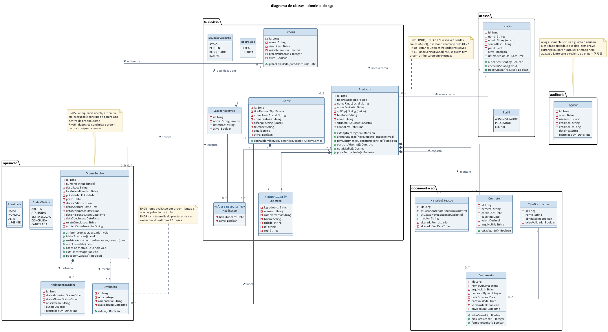
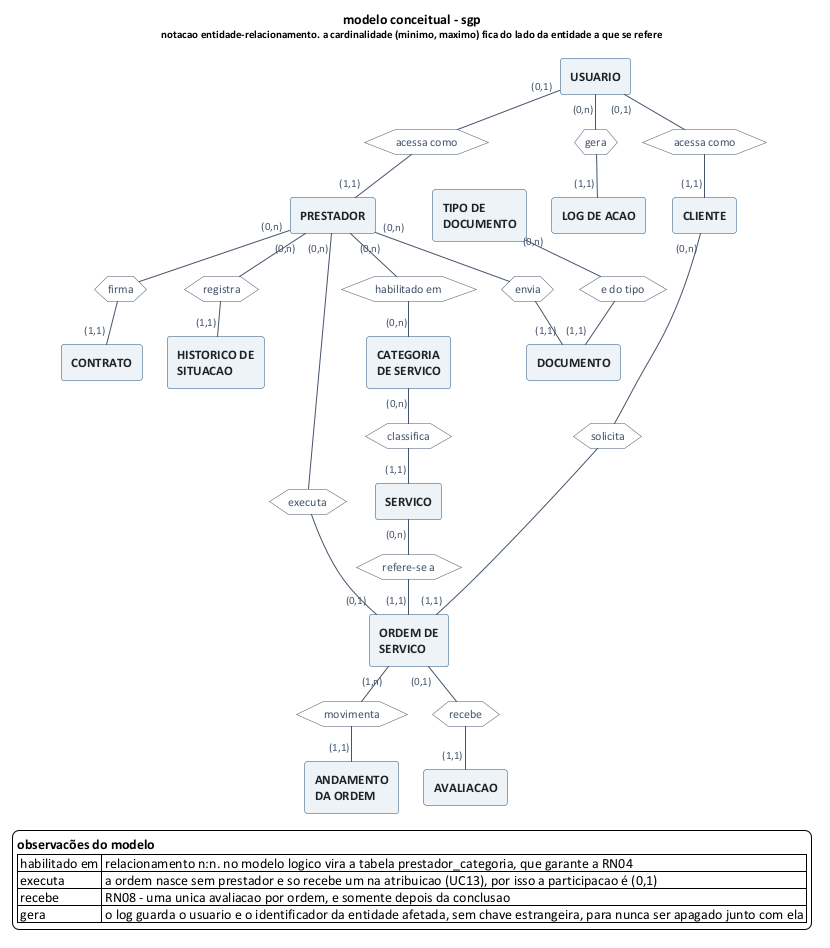
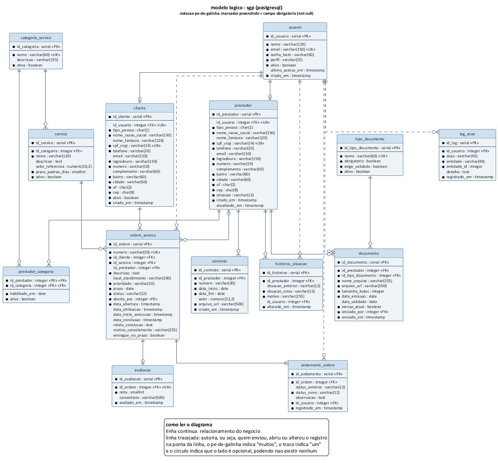

# sgp - sistema de gestao de prestadores
## diagrama de classes, modelo de dados e dicionario de dados

**versao 1.1 - 22/09/2026 - complemento da 2ª entrega**
unicesumar - analise e desenvolvimento de sistemas
imersao profissional - projeto de software - equipe 8

---

## 1. identificacao do documento

| item | descricao |
|---|---|
| sistema | sgp - sistema de gestao de prestadores |
| documento | diagrama de classes, modelo conceitual, modelo logico e dicionario de dados |
| entrega | 2ª entrega - modelagem (itens que ficaram pendentes e foram concluidos agora) |
| equipe | equipe 8 |
| integrantes | luis gustavo boratto de oliveira, igor schiniegoski pallisser |
| documentos de origem | [documento-visao-requisitos.md](documento-visao-requisitos.md) versao 1.0 e [casos-de-uso.md](casos-de-uso.md) versao 1.1 |
| notacao | uml 2.5 para o diagrama de classes, entidade-relacionamento para o conceitual e pe-de-galinha para o logico |
| ferramenta | plantuml, com o fonte `.puml` versionado junto da imagem |
| banco previsto | postgresql 16 |

### 1.1 objetivo deste documento

a 1ª entrega definiu o que o sistema precisa fazer e a 2ª entrega descreveu como o usuario interage com ele. faltava a parte estrutural: quais objetos o sistema manipula, como eles se relacionam e como essa informacao fica guardada. é isso que este documento resolve.

o que existe no dominio do problema esta no diagrama de classes da secao 3. como essas informacões se relacionam esta no modelo conceitual da secao 4. e como isso vira tabela no banco esta no modelo logico da secao 5, detalhado campo a campo no dicionario da secao 6.

### 1.2 relacao com os demais documentos

| documento | entrega | o que ele define | como este documento se apoia nele |
|---|---|---|---|
| documento de visao e requisitos | 1ª | 19 RF, 11 RNF e 12 RN | cada tabela nasce de um requisito, e cada RN aparece como restricao no banco ou como metodo de classe |
| casos de uso e historias | 2ª | 24 casos de uso e 23 historias | os dados manipulados em cada fluxo viraram atributo de classe e coluna de tabela |
| tecnologias e arquitetura | 2ª | stack e camadas | o modelo logico foi escrito para postgresql com prisma, conforme decidido la |

---

## 2. como o modelo foi construido

o caminho seguido foi o mesmo das disciplinas de modelagem: primeiro o dominio, depois o conceitual, depois o logico.

1. levantamento dos substantivos. foram lidos os 19 requisitos funcionais e os fluxos dos casos de uso, separando tudo que o sistema precisa guardar: prestador, cliente, categoria, servico, documento, contrato, ordem, avaliacao, log.
2. separacao entre o que é entidade e o que é atributo. endereco, por exemplo, aparece no cadastro mas nao tem vida propria, entao ficou como conjunto de colunas dentro de prestador e de cliente. tipo de documento, ao contrario, precisa ser cadastrado e alterado pelo administrador, entao virou entidade.
3. identificacao dos relacionamentos e das cardinalidades, a partir das regras de negocio. a RN04 exige que o prestador esteja habilitado na categoria, e é dai que sai o relacionamento n:n entre prestador e categoria.
4. mapeamento para o modelo logico, resolvendo o n:n em tabela propria, escolhendo tipos e definindo chaves, restricões e indices.
5. conferencia de rastreabilidade, verificando se cada RF e cada RN tem onde se apoiar no banco (secao 8).

---

## 3. diagrama de classes do dominio

### 3.1 visao geral

o diagrama esta organizado em cinco pacotes, que seguem os mesmos modulos usados nos diagramas de caso de uso da 2ª entrega: acesso, cadastros, documentacao, operacao e auditoria.

### 3.2 classes e responsabilidades

| classe | pacote | responsabilidade | origem |
|---|---|---|---|
| `Usuario` | acesso | guarda a credencial e o perfil de quem entra no sistema, e responde se o usuario pode acessar determinado recurso | RF01, RNF01, RNF02 |
| `Perfil` | acesso | enumeracao dos tres perfis previstos: administrador, prestador e cliente | RF01 |
| `Prestador` | cadastros | representa o terceirizado, concentra a situacao cadastral e responde se ele esta apto a receber uma ordem | RF02, RF09 |
| `Cliente` | cadastros | representa quem solicita o servico e abre a ordem | RF03, RF11 |
| `Endereco` | cadastros | objeto de valor usado por prestador e por cliente, sem identidade propria | RF02, RF03 |
| `CategoriaServico` | cadastros | classifica os servicos e define a area em que o prestador atua | RF04 |
| `Servico` | cadastros | item do catalogo, com valor de referencia e prazo padrao | RF05 |
| `Habilitacao` | cadastros | classe associativa entre prestador e categoria, com a data em que a habilitacao passou a valer | RF06 |
| `TipoDocumento` | documentacao | define os tipos aceitos e quais deles sao obrigatorios | RF07, RN02 |
| `Documento` | documentacao | arquivo enviado pelo prestador, com emissao e validade, e sabe dizer se esta vencido | RF07, RF08 |
| `Contrato` | documentacao | contrato do prestador, com vigencia e arquivo anexo | RF10 |
| `HistoricoSituacao` | documentacao | registra cada mudanca de situacao cadastral com motivo e responsavel | RF09 |
| `OrdemServico` | operacao | concentra o ciclo de vida da ordem e controla a mudanca de status | RF11 a RF14 |
| `AndamentoOrdem` | operacao | cada movimentacao da ordem, com status anterior, status novo, observacao e autor | RF13 |
| `Avaliacao` | operacao | nota e comentario lancados pelo cliente ao final da ordem | RF15 |
| `StatusOrdem`, `Prioridade` | operacao | enumeracões usadas pela ordem de servico | RF11, RF13 |
| `LogAcao` | auditoria | registro imutavel das acões criticas | RF19 |

### 3.3 onde cada regra de negocio esta no diagrama

o diagrama nao serve so para mostrar dado. as regras da 1ª entrega foram colocadas como metodo na classe que tem a informacao necessaria para verifica-las, e nao espalhadas pela tela:

| regra | classe | metodo |
|---|---|---|
| RN01, RN02, RN03, RN04 | `Prestador` | `estaApto(categoria)`, chamado pelo UC22 |
| RN05 - sequencia dos status | `OrdemServico` | `atribuir()`, `iniciarExecucao()`, `concluir()` |
| RN06 - ordem concluida é imutavel | `OrdemServico` | os metodos de alteracao recusam quando o status é concluida |
| RN07 - cancelamento exige motivo | `OrdemServico` | `cancelar(motivo, usuario)` |
| RN08 - avaliacao unica e pelo cliente | `Avaliacao` e `OrdemServico` | `valida()` e `podeSerAvaliada()` |
| RN09 - calculo da nota media | `Prestador` | `notaMedia()` |
| RN10 - cpf e cnpj unicos | `Prestador` e `Cliente` | restricao de unicidade no banco, conferida antes de gravar |
| RN11 - prestador com ordem aberta nao é inativado | `Prestador` | `podeSerInativado()` |
| RN12 - prazo e atraso | `OrdemServico` | `estaEmAtraso()` |

### 3.4 diferencas entre o diagrama de classes e o modelo de dados

os dois modelos descrevem o mesmo sistema, mas nao sao iguais, e a diferenca é proposital:

| situacao | no diagrama de classes | no modelo de dados | por que |
|---|---|---|---|
| endereco | classe `Endereco`, ligada por composicao | colunas dentro de `prestador` e de `cliente` | o endereco nao é consultado sozinho e nao tem identidade propria, separar em tabela so criaria juncao sem ganho |
| enumeracões | `Perfil`, `SituacaoCadastral`, `StatusOrdem`, `Prioridade`, `TipoPessoa` | coluna de texto com restricao `check` | o conjunto de valores é pequeno e estavel, e a restricao no banco ja impede valor invalido |
| autoria dos registros | atributo `alteradoPor`, `autor`, `usuario` | chave estrangeira para `usuario` | no diagrama seriam quatro linhas atravessando todo o desenho, o que atrapalha a leitura sem acrescentar informacao |
| habilitacao | classe associativa `Habilitacao` | tabela `prestador_categoria` com chave primaria composta | é o mapeamento padrao de um relacionamento n:n com atributo proprio |
| comportamento | metodos como `estaApto()` e `estaVencido()` | nao existe | o banco guarda o dado, a regra vive na aplicacao, conforme a arquitetura em camadas definida na 2ª entrega |

---

## 4. modelo conceitual

### 4.1 diagrama

o modelo conceitual mostra as entidades e como elas se relacionam, sem se preocupar com tipo de dado, chave ou tecnologia. a cardinalidade usa o formato (minimo, maximo) e fica ao lado da entidade a que se refere.

### 4.2 entidades

| entidade | o que representa | origem |
|---|---|---|
| usuario | quem acessa o sistema, com email, senha e perfil | RF01 |
| prestador | o terceirizado que executa os servicos | RF02 |
| cliente | quem solicita o servico e avalia o atendimento | RF03 |
| categoria de servico | area de atuacao usada para classificar servico e prestador | RF04 |
| servico | item do catalogo que pode ser solicitado | RF05 |
| tipo de documento | especie de documento aceita, e se ela é obrigatoria | RF07 |
| documento | arquivo enviado pelo prestador, com validade | RF07, RF08 |
| contrato | acordo firmado com o prestador, com vigencia | RF10 |
| historico de situacao | cada mudanca de situacao cadastral do prestador | RF09 |
| ordem de servico | a demanda, do pedido do cliente ate a conclusao | RF11 a RF14 |
| andamento da ordem | cada movimentacao registrada durante a execucao | RF13 |
| avaliacao | nota e comentario do cliente sobre o atendimento | RF15 |
| log de acao | registro das acões criticas para auditoria | RF19 |

### 4.3 relacionamentos

| relacionamento | entre | cardinalidade | leitura | regra envolvida |
|---|---|---|---|---|
| acessa como | usuario e prestador | (0,1) para (1,1) | um usuario pode estar vinculado a um cadastro de prestador, e todo prestador com acesso tem um unico usuario | RF01 |
| acessa como | usuario e cliente | (0,1) para (1,1) | mesma leitura do anterior, aplicada ao cliente | RF01 |
| habilitado em | prestador e categoria | (0,n) para (0,n) | um prestador atua em varias categorias e uma categoria tem varios prestadores | RN04 |
| classifica | categoria e servico | (0,n) para (1,1) | todo servico pertence a uma unica categoria | RF05 |
| envia | prestador e documento | (0,n) para (1,1) | o prestador envia varios documentos, e cada documento é de um unico prestador | RF07 |
| e do tipo | tipo de documento e documento | (0,n) para (1,1) | cada documento é classificado em um tipo | RN02 |
| firma | prestador e contrato | (0,n) para (1,1) | o prestador pode ter varios contratos ao longo do tempo | RN03 |
| registra | prestador e historico de situacao | (0,n) para (1,1) | cada alteracao de situacao pertence a um prestador | RF09 |
| solicita | cliente e ordem | (0,n) para (1,1) | toda ordem tem um cliente solicitante | RF11 |
| refere-se a | servico e ordem | (0,n) para (1,1) | toda ordem aponta para um servico do catalogo | RF11 |
| executa | prestador e ordem | (0,n) para (0,1) | a ordem nasce sem prestador e recebe um na atribuicao | RN01, RN05 |
| movimenta | ordem e andamento | (1,n) para (1,1) | toda ordem tem pelo menos o registro da abertura | RF13 |
| recebe | ordem e avaliacao | (0,1) para (1,1) | uma ordem recebe no maximo uma avaliacao | RN08 |
| gera | usuario e log | (0,n) para (1,1) | todo registro de log aponta o usuario responsavel | RF19 |

---

## 5. modelo logico

### 5.1 diagrama

### 5.2 decisões tomadas no mapeamento

| decisao | o que foi feito | por que |
|---|---|---|
| chave primaria | toda tabela usa uma coluna `serial` propria, sem chave composta de negocio, exceto `prestador_categoria` | cpf e cnpj mudam de dono e de formato, e chave natural em tabela grande complica a integracao com o orm |
| relacionamento n:n | virou a tabela `prestador_categoria`, com chave primaria composta pelas duas chaves estrangeiras | é o mapeamento padrao, e a chave composta ja impede habilitar o mesmo prestador duas vezes na mesma categoria |
| endereco | virou colunas dentro de `prestador` e de `cliente` | nao é consultado de forma independente |
| enumeracões | viraram `varchar` com restricao `check` | evita tabela de dominio com tres linhas e mantem a leitura da consulta direta |
| exclusao de registro | nenhuma tabela apaga linha, tudo usa campo de situacao ou de ativo | a RN06 e o RF19 exigem historico, e a LGPD é atendida por anonimizacao e nao por delecao fisica |
| arquivos | o banco guarda apenas a url e os metadados, o arquivo vai para o storage em nuvem | RNF09, e o banco do plano gratuito nao comporta binario |
| historico de status | ficou em `andamento_ordem`, separado da ordem | a ordem guarda o estado atual, o historico guarda o caminho percorrido |
| log | `log_acao` guarda `entidade` e `entidade_id` como texto e numero, sem chave estrangeira | o log precisa sobreviver a qualquer alteracao no registro de origem |

### 5.3 tabelas do modelo

| tabela | o que guarda | chave primaria | chaves estrangeiras |
|---|---|---|---|
| `usuario` | credencial e perfil de acesso | `id_usuario` | - |
| `prestador` | cadastro do terceirizado | `id_prestador` | `id_usuario` |
| `cliente` | cadastro de quem solicita | `id_cliente` | `id_usuario` |
| `categoria_servico` | areas de atuacao | `id_categoria` | - |
| `servico` | catalogo de servicos | `id_servico` | `id_categoria` |
| `prestador_categoria` | habilitacao do prestador por categoria | `id_prestador` + `id_categoria` | `id_prestador`, `id_categoria` |
| `tipo_documento` | especies de documento aceitas | `id_tipo_documento` | - |
| `documento` | arquivos do prestador com validade | `id_documento` | `id_prestador`, `id_tipo_documento`, `enviado_por` |
| `contrato` | contratos com vigencia | `id_contrato` | `id_prestador` |
| `historico_situacao` | mudancas de situacao cadastral | `id_historico` | `id_prestador`, `id_usuario` |
| `ordem_servico` | a demanda e seu estado atual | `id_ordem` | `id_cliente`, `id_servico`, `id_prestador`, `aberta_por` |
| `andamento_ordem` | historico de movimentacao da ordem | `id_andamento` | `id_ordem`, `id_usuario` |
| `avaliacao` | nota e comentario do cliente | `id_avaliacao` | `id_ordem` |
| `log_acao` | auditoria das acões criticas | `id_log` | `id_usuario` |

---

## 6. dicionario de dados

os tipos seguem o postgresql. a coluna "obrig." indica `not null`.

### 6.1 usuario

guarda quem pode entrar no sistema. prestador e cliente so recebem acesso quando ha um registro aqui vinculado ao cadastro deles.

| campo | tipo | obrig. | descricao | restricao |
|---|---|---|---|---|
| id_usuario | serial | sim | identificador interno | chave primaria |
| nome | varchar(120) | sim | nome de exibicao | - |
| email | varchar(150) | sim | usado como login | unico |
| senha_hash | varchar(60) | sim | senha gravada com bcrypt | RNF01, nunca em texto puro |
| perfil | varchar(15) | sim | administrador, prestador ou cliente | check com os tres valores |
| ativo | boolean | sim | conta liberada para entrar | padrao verdadeiro |
| ultimo_acesso_em | timestamp | nao | momento do ultimo login | - |
| criado_em | timestamp | sim | data de criacao da conta | padrao data atual |

### 6.2 prestador

cadastro do terceirizado. a situacao cadastral desta tabela é o que libera ou bloqueia a atribuicao de ordens.

| campo | tipo | obrig. | descricao | restricao |
|---|---|---|---|---|
| id_prestador | serial | sim | identificador interno | chave primaria |
| id_usuario | integer | nao | conta de acesso do prestador | fk para usuario, unico. fica nulo enquanto o administrador ainda nao liberou o acesso |
| tipo_pessoa | char(1) | sim | F para fisica, J para juridica | check em F ou J |
| nome_razao_social | varchar(150) | sim | nome ou razao social, como consta no cadastro da receita | - |
| nome_fantasia | varchar(120) | nao | como o prestador é conhecido no dia a dia. aparece abaixo da razao social nas listagens | - |
| cpf_cnpj | varchar(14) | sim | so os digitos, sem ponto nem traco | unico, validado pelo digito verificador (RN10) |
| telefone | varchar(20) | sim | contato principal | - |
| email | varchar(150) | nao | contato secundario | - |
| logradouro | varchar(150) | sim | rua ou avenida | - |
| numero | varchar(10) | sim | numero do endereco | - |
| complemento | varchar(60) | nao | apartamento, sala, bloco | - |
| bairro | varchar(60) | sim | bairro | - |
| cidade | varchar(60) | sim | cidade | - |
| uf | char(2) | sim | sigla do estado | check com as 27 siglas |
| cep | char(8) | sim | so os digitos | - |
| situacao | varchar(12) | sim | ativo, pendente, bloqueado ou inativo | check com os quatro valores, padrao pendente |
| criado_em | timestamp | sim | data do cadastro | padrao data atual |
| atualizado_em | timestamp | nao | ultima alteracao | - |

### 6.3 cliente

| campo | tipo | obrig. | descricao | restricao |
|---|---|---|---|---|
| id_cliente | serial | sim | identificador interno | chave primaria |
| id_usuario | integer | nao | conta de acesso do cliente | fk para usuario, unico |
| tipo_pessoa | char(1) | sim | F ou J | check em F ou J |
| nome_razao_social | varchar(150) | sim | nome ou razao social | - |
| nome_fantasia | varchar(120) | nao | nome pelo qual o cliente é conhecido | - |
| cpf_cnpj | varchar(14) | sim | so os digitos | unico (RN10) |
| telefone | varchar(20) | sim | contato principal | - |
| email | varchar(150) | nao | contato secundario | - |
| logradouro | varchar(150) | sim | rua ou avenida | - |
| numero | varchar(10) | sim | numero do endereco | - |
| complemento | varchar(60) | nao | complemento | - |
| bairro | varchar(60) | sim | bairro | - |
| cidade | varchar(60) | sim | cidade | - |
| uf | char(2) | sim | sigla do estado | check |
| cep | char(8) | sim | so os digitos | - |
| ativo | boolean | sim | cliente em atividade | padrao verdadeiro |
| criado_em | timestamp | sim | data do cadastro | padrao data atual |

### 6.4 categoria_servico

| campo | tipo | obrig. | descricao | restricao |
|---|---|---|---|---|
| id_categoria | serial | sim | identificador interno | chave primaria |
| nome | varchar(60) | sim | nome da categoria, como eletrica ou limpeza | unico |
| descricao | varchar(255) | nao | o que a categoria abrange | - |
| ativa | boolean | sim | categoria disponivel para uso | padrao verdadeiro |

### 6.5 servico

| campo | tipo | obrig. | descricao | restricao |
|---|---|---|---|---|
| id_servico | serial | sim | identificador interno | chave primaria |
| id_categoria | integer | sim | categoria a que pertence | fk para categoria_servico |
| nome | varchar(120) | sim | nome do servico | - |
| descricao | text | nao | o que o servico inclui | - |
| valor_referencia | numeric(10,2) | nao | valor usado como base | maior ou igual a zero |
| prazo_padrao_dias | smallint | sim | prazo aplicado quando o cliente nao informa um | maior que zero |
| ativo | boolean | sim | servico disponivel no catalogo | padrao verdadeiro |

### 6.6 prestador_categoria

tabela que resolve o relacionamento n:n e sustenta a RN04.

| campo | tipo | obrig. | descricao | restricao |
|---|---|---|---|---|
| id_prestador | integer | sim | prestador habilitado | chave primaria composta, fk para prestador |
| id_categoria | integer | sim | categoria em que atua | chave primaria composta, fk para categoria_servico |
| habilitado_em | date | sim | data em que a habilitacao passou a valer | - |
| ativa | boolean | sim | habilitacao em vigor | padrao verdadeiro |

### 6.7 tipo_documento

| campo | tipo | obrig. | descricao | restricao |
|---|---|---|---|---|
| id_tipo_documento | serial | sim | identificador interno | chave primaria |
| nome | varchar(60) | sim | rg, cnpj, certidao negativa, apolice de seguro | unico |
| obrigatorio | boolean | sim | se a falta ou o vencimento bloqueia o prestador | usado pela RN02 |
| exige_validade | boolean | sim | se o tipo exige data de validade | - |
| ativo | boolean | sim | tipo disponivel para envio | padrao verdadeiro |

### 6.8 documento

| campo | tipo | obrig. | descricao | restricao |
|---|---|---|---|---|
| id_documento | serial | sim | identificador interno | chave primaria |
| id_prestador | integer | sim | dono do documento | fk para prestador |
| id_tipo_documento | integer | sim | especie do documento | fk para tipo_documento |
| nome_arquivo | varchar(255) | sim | nome original do arquivo enviado | - |
| arquivo_url | varchar(500) | sim | endereco do arquivo no storage | - |
| tamanho_bytes | integer | sim | tamanho do arquivo | ate 10 mb (RNF09) |
| data_emissao | date | sim | data em que o documento foi emitido | nao pode ser maior que a validade |
| data_validade | date | nao | vencimento, quando o tipo exige | obrigatorio quando exige_validade é verdadeiro |
| versao_atual | boolean | sim | marca a versao valida, mantendo as anteriores no historico | padrao verdadeiro |
| enviado_por | integer | sim | usuario que fez o envio | fk para usuario |
| enviado_em | timestamp | sim | momento do envio | padrao data atual |

### 6.9 contrato

| campo | tipo | obrig. | descricao | restricao |
|---|---|---|---|---|
| id_contrato | serial | sim | identificador interno | chave primaria |
| id_prestador | integer | sim | prestador contratado | fk para prestador |
| numero | varchar(30) | sim | numero do contrato | - |
| data_inicio | date | sim | inicio da vigencia | - |
| data_fim | date | sim | fim da vigencia | maior que a data de inicio |
| valor | numeric(12,2) | nao | valor acordado | maior ou igual a zero |
| arquivo_url | varchar(500) | sim | contrato assinado, anexado em pdf | RNF09 |
| criado_em | timestamp | sim | data do cadastro | padrao data atual |

### 6.10 historico_situacao

| campo | tipo | obrig. | descricao | restricao |
|---|---|---|---|---|
| id_historico | serial | sim | identificador interno | chave primaria |
| id_prestador | integer | sim | prestador que mudou de situacao | fk para prestador |
| situacao_anterior | varchar(12) | nao | situacao antes da mudanca, nulo no primeiro registro | check |
| situacao_nova | varchar(12) | sim | situacao depois da mudanca | check |
| motivo | varchar(255) | sim | justificativa da alteracao | minimo de 10 caracteres |
| id_usuario | integer | nao | quem alterou. fica nulo quando a mudanca foi automatica pela RN02 | fk para usuario |
| alterado_em | timestamp | sim | momento da alteracao | padrao data atual |

### 6.11 ordem_servico

tabela central do sistema. guarda o estado atual da ordem, enquanto o caminho percorrido fica em `andamento_ordem`.

| campo | tipo | obrig. | descricao | restricao |
|---|---|---|---|---|
| id_ordem | serial | sim | identificador interno | chave primaria |
| numero | varchar(20) | sim | numero visivel ao usuario, no formato OS-2026-0001 | unico |
| id_cliente | integer | sim | cliente solicitante | fk para cliente |
| id_servico | integer | sim | servico do catalogo | fk para servico |
| id_prestador | integer | nao | prestador responsavel, preenchido na atribuicao | fk para prestador |
| descricao | text | sim | o que o cliente precisa | minimo de 20 caracteres |
| local_atendimento | varchar(200) | nao | onde o servico sera executado, quando for diferente do endereco do cadastro do cliente. fica em branco quando é no endereco principal | - |
| prioridade | varchar(10) | sim | baixa, normal, alta ou urgente | check, padrao normal |
| prazo | date | sim | prazo combinado, calculado pelo servico quando nao informado | nao pode ser anterior a abertura |
| status | varchar(12) | sim | aberta, atribuida, em execucao, concluida ou cancelada | check, padrao aberta (RN05) |
| aberta_por | integer | sim | usuario que registrou a ordem | fk para usuario |
| data_abertura | timestamp | sim | momento da abertura | padrao data atual |
| data_atribuicao | timestamp | nao | momento da atribuicao ao prestador | - |
| data_inicio_execucao | timestamp | nao | inicio da execucao | - |
| data_conclusao | timestamp | nao | conclusao do servico | - |
| relato_conclusao | text | nao | o que foi executado, obrigatorio ao concluir | exigido quando o status é concluida |
| motivo_cancelamento | varchar(255) | nao | justificativa do cancelamento | minimo de 10 caracteres (RN07) |
| entregue_no_prazo | boolean | nao | calculado na conclusao comparando prazo e data de conclusao | RN12 |

### 6.12 andamento_ordem

| campo | tipo | obrig. | descricao | restricao |
|---|---|---|---|---|
| id_andamento | serial | sim | identificador interno | chave primaria |
| id_ordem | integer | sim | ordem movimentada | fk para ordem_servico |
| status_anterior | varchar(12) | nao | status antes da movimentacao | check |
| status_novo | varchar(12) | sim | status depois da movimentacao | check |
| observacao | text | nao | anotacao do prestador ou do administrador | - |
| id_usuario | integer | sim | autor da movimentacao | fk para usuario |
| registrado_em | timestamp | sim | momento do registro | padrao data atual |

### 6.13 avaliacao

| campo | tipo | obrig. | descricao | restricao |
|---|---|---|---|---|
| id_avaliacao | serial | sim | identificador interno | chave primaria |
| id_ordem | integer | sim | ordem avaliada | fk para ordem_servico, unico (RN08) |
| nota | smallint | sim | nota de 1 a 5 | check entre 1 e 5 |
| comentario | varchar(500) | nao | comentario do cliente | - |
| avaliado_em | timestamp | sim | momento da avaliacao | padrao data atual |

### 6.14 log_acao

| campo | tipo | obrig. | descricao | restricao |
|---|---|---|---|---|
| id_log | serial | sim | identificador interno | chave primaria |
| id_usuario | integer | sim | quem executou a acao | fk para usuario |
| acao | varchar(40) | sim | alteracao de situacao, atribuicao ou cancelamento | check com as acões previstas |
| entidade | varchar(40) | sim | nome da tabela afetada | - |
| entidade_id | integer | sim | identificador do registro afetado | sem chave estrangeira, de proposito |
| detalhe | text | nao | resumo do que mudou | - |
| registrado_em | timestamp | sim | momento do registro | padrao data atual |

---

## 7. restricões, indices e o que o banco garante sozinho

nem toda regra precisa de codigo. parte delas o proprio banco resolve, e isso vale como segunda barreira caso alguem chame a api por fora da tela (RNF02).

| regra ou requisito | como o banco ajuda |
|---|---|
| RN10 - cpf e cnpj unicos | restricao `unique` em `prestador.cpf_cnpj` e em `cliente.cpf_cnpj`. o digito verificador é validado na aplicacao antes de gravar |
| RN04 - habilitacao por categoria | chave primaria composta em `prestador_categoria` impede duplicar a habilitacao |
| RN05 - sequencia dos status | restricao `check` limita os valores possiveis. a ordem entre eles é garantida pela aplicacao, que é quem conhece o status anterior |
| RN07 - motivo do cancelamento | `check` de tamanho minimo em `motivo_cancelamento` |
| RN08 - uma avaliacao por ordem | restricao `unique` em `avaliacao.id_ordem` |
| RF19 - log imutavel | a aplicacao acessa `log_acao` apenas com insercao e leitura. nenhuma rotina de atualizacao ou exclusao é criada para essa tabela |
| RNF06 - listagem em ate 3 segundos | indices nas colunas usadas em filtro, listadas abaixo |
| RNF09 - limite de 10 mb | `check` em `documento.tamanho_bytes`, alem da validacao no envio |

indices previstos alem das chaves:

| tabela | coluna | por que |
|---|---|---|
| `ordem_servico` | `status`, `prazo` | filtro das listagens e calculo de atraso |
| `ordem_servico` | `id_prestador`, `id_cliente` | recorte por perfil, aplicado em toda consulta (RNF02) |
| `documento` | `data_validade`, `versao_atual` | painel de vencimentos do RF08 |
| `prestador` | `situacao` | lista de prestadores aptos na atribuicao |
| `avaliacao` | `avaliado_em` | nota media dos ultimos 12 meses (RN09) |
| `log_acao` | `registrado_em`, `entidade` | consulta de auditoria |

---

## 8. rastreabilidade entre requisito e banco

| requisito | caso de uso | tabelas envolvidas |
|---|---|---|
| RF01 - autenticar usuario | UC01 | `usuario` |
| RF02 - manter prestadores | UC03 | `prestador` |
| RF03 - manter clientes | UC04 | `cliente` |
| RF04 - manter categorias | UC05 | `categoria_servico` |
| RF05 - manter catalogo | UC06 | `servico` |
| RF06 - habilitar em categorias | UC07 | `prestador_categoria` |
| RF07 - enviar documentos | UC08 | `documento`, `tipo_documento` |
| RF08 - alertar vencimentos | UC09 | `documento`, `prestador` |
| RF09 - situacao cadastral | UC11 | `prestador`, `historico_situacao` |
| RF10 - manter contratos | UC10 | `contrato` |
| RF11 - registrar ordem | UC12 | `ordem_servico` |
| RF12 - atribuir ordem | UC13, UC22 | `ordem_servico`, `prestador`, `prestador_categoria`, `documento`, `contrato` |
| RF13 - acompanhar a ordem | UC14 a UC17 | `ordem_servico`, `andamento_ordem` |
| RF14 - ordens do prestador | UC15, UC16 | `ordem_servico` |
| RF15 - avaliar atendimento | UC18 | `avaliacao` |
| RF16 - consultar historico | UC19 | `ordem_servico`, `andamento_ordem`, `avaliacao` |
| RF17 - relatorio de desempenho | UC20 | `ordem_servico`, `avaliacao`, `prestador` |
| RF18 - relatorio por periodo | UC21 | `ordem_servico`, `servico`, `categoria_servico` |
| RF19 - log de acões criticas | UC23 | `log_acao` |

**cobertura:** os 19 requisitos funcionais tem tabela correspondente, e nenhuma tabela foi criada sem requisito que a justifique.

---

## 9. carga inicial prevista

para o sistema abrir utilizavel, algumas tabelas precisam ja nascer com conteudo:

| tabela | conteudo inicial |
|---|---|
| `usuario` | um administrador, criado na instalacao |
| `tipo_documento` | cpf, rg, cnpj, certidao negativa de debitos, comprovante de endereco, apolice de seguro e certificado de curso, com a marcacao de quais sao obrigatorios |
| `categoria_servico` | eletrica, hidraulica, limpeza, manutencao predial, refrigeracao e informatica |

os demais dados de teste serao ficticios, conforme a restricao de LGPD definida na 1ª entrega.

---

## 10. o que fica para a implementacao

| item | quando |
|---|---|
| script de criacao das tabelas | gerado pelas migracões do prisma no inicio da 3ª entrega |
| ajuste fino dos indices | depois da carga de teste, medindo com a base de 5 mil registros do RNF06 |
| rotina de anonimizacao para a LGPD | junto do modulo de cadastro, na release 1 |

---

## 11. referencias

- orientacões para as entregas - projeto de software, 1º bimestre. documento da disciplina, unicesumar, 2026.
- sgp - documento de visao e requisitos, versao 1.0, equipe 8, 14/08/2026.
- sgp - documento de casos de uso, historias de usuario e priorizacao, equipe 8, 21/08/2026.
- elmasri, r.; navathe, s. b. *sistemas de banco de dados*. 7. ed. sao paulo: pearson, 2018.
- heuser, c. a. *projeto de banco de dados*. 6. ed. porto alegre: bookman, 2009.
- object management group. *omg unified modeling language (omg uml), version 2.5.1*. 2017.

---

## historico de alteracões

| versao | data | alteracao |
|---|---|---|
| 1.0 | 22/09/2026 | primeira versao, com o diagrama de classes, o modelo conceitual, o modelo logico e o dicionario de dados que estavam pendentes da 2ª entrega |
| 1.1 | 22/09/2026 | acrescentados `nome_fantasia` em prestador e cliente e `local_atendimento` na ordem de servico. os tres apareciam nas telas do prototipo e nao existiam no modelo, o que quebrava a rastreabilidade entre tela e banco |
