# sgp - sistema de gestao de prestadores
## definicao do mvp, mapa de navegacao e prototipo de telas

**versao 1.0 - 22/09/2026 - 3ª entrega**
unicesumar - analise e desenvolvimento de sistemas
imersao profissional - projeto de software - equipe 8

---

## 1. identificacao do documento

| item | descricao |
|---|---|
| sistema | sgp - sistema de gestao de prestadores |
| documento | definicao do produto minimo viavel, levantamento de telas, mapa de navegacao e prototipo |
| entrega | 3ª entrega - 25/09/2026 |
| equipe | equipe 8 |
| integrantes | luis gustavo boratto de oliveira, igor schiniegoski pallisser |
| documentos de origem | [documento-visao-requisitos.md](documento-visao-requisitos.md), [casos-de-uso.md](casos-de-uso.md) e [modelo-de-dados.md](modelo-de-dados.md) |
| prototipo | 24 telas em html, na pasta [prototipos/](../prototipos/index.html) |

### 1.1 o que esta entrega acrescenta

as duas primeiras entregas responderam o que o sistema precisa fazer e como o usuario interage com ele. faltava decidir por onde comecar, e é isso que este documento resolve. a secao 3 define o mvp, ou seja, o que sera construido primeiro. a secao 6 mostra como o usuario anda pelo sistema. a secao 7 mostra a cara de cada tela.

---

## 2. revisao das entregas anteriores

o manual da 3ª entrega pede que a documentacao ja produzida seja revisada antes de qualquer material novo, para evitar que requisito, modelo, tela e mvp contem historias diferentes. a conferencia foi feita item a item.

| item conferido | resultado |
|---|---|
| problema e justificativa | mantidos. continuam coerentes com a solucao proposta |
| objetivos | mantidos. os seis objetivos especificos tem caso de uso correspondente |
| perfis de usuario | mantidos. os tres perfis aparecem nos casos de uso, nas historias e agora tambem nas telas |
| escopo | reduzido de forma explicita pela priorizacao moscow, e agora tambem pela definicao do mvp da secao 3 |
| requisitos funcionais | os 19 continuam validos e numerados. nenhum foi renumerado, para nao quebrar a rastreabilidade |
| requisitos nao funcionais | os 11 continuam validos. o RNF04 (responsividade) passou a ser verificavel no prototipo |
| regras de negocio | as 12 continuam validas e cada uma aparece em pelo menos uma tela do prototipo |
| casos de uso | os 24 continuam validos. a 2ª entrega ganhou os diagramas de atividade de UC13 e UC16 |
| modelo de dados | concluido no complemento da 2ª entrega, com as 14 tabelas e o dicionario |
| nomenclatura | padronizada: o mesmo nome usado no requisito aparece na entidade, na tabela e no rotulo da tela |
| rastreabilidade | ampliada na secao 8, que agora liga requisito, caso de uso, entidade, tela e mvp |

### 2.1 correcões e complementos feitos

| quando | o que mudou | onde |
|---|---|---|
| 22/09/2026 | acrescentados os diagramas de atividade de UC13 e UC16 | casos-de-uso.md, secao 7.18, versao 1.1 |
| 22/09/2026 | acrescentados o diagrama de classes, o modelo conceitual, o modelo logico e o dicionario de dados | modelo-de-dados.md, versao 1.0 |
| 22/09/2026 | o diagrama de arquitetura, que existia apenas como texto, virou diagrama | diagramas/arquitetura.png |
| 22/09/2026 | a lista de pendencias da secao 10 do documento de casos de uso foi atualizada | casos-de-uso.md, secao 10 |

nenhum requisito foi renumerado e nenhum documento anterior foi reescrito: as correcões entraram como complemento, com o historico de alteracões atualizado em cada arquivo.

---

## 3. definicao do produto minimo viavel

### 3.1 o criterio usado

mvp nao quer dizer a parte facil do sistema, nem tudo que der tempo de fazer. o criterio que a equipe adotou foi outro: entra no mvp o que for necessario para executar o fluxo completo do inicio ao fim, sem depender de contorno manual. o teste é simples, basta tirar a funcionalidade e ver se o caminho do cliente pedir ate avaliar continua de pé. se nao continuar, ela é indispensavel.

é o mesmo criterio da priorizacao moscow da 2ª entrega, e por isso o mvp acabou correspondendo exatamente aos 16 casos de uso classificados como must have.

### 3.2 o que entra e o que fica de fora

| funcionalidade | caso de uso | classificacao | entra no mvp? | justificativa |
|---|---|---|---|---|
| autenticacao e controle de acesso | UC01, UC02 | indispensavel | **sim** | sem identificar o perfil nao ha como aplicar nenhuma regra de permissao |
| cadastro de prestadores | UC03 | indispensavel | **sim** | é a base de todo o sistema, nao ha o que atribuir sem ele |
| cadastro de clientes | UC04 | indispensavel | **sim** | toda ordem precisa de um solicitante |
| categorias e catalogo de servicos | UC05, UC06 | indispensavel | **sim** | a categoria é o que liga o servico ao prestador habilitado (RN04) |
| habilitacao do prestador por categoria | UC07 | indispensavel | **sim** | sem ela a atribuicao nao tem como saber quem pode atender |
| envio de documentos com validade | UC08 | indispensavel | **sim** | é o diferencial do sistema frente a planilha, e sustenta a RN02 |
| painel de vencimentos | UC09 | indispensavel | **sim** | resolve o problema que motivou o projeto: documento que vence sem ninguem perceber |
| situacao cadastral com motivo | UC11 | indispensavel | **sim** | controla quem esta liberado a receber servico |
| abertura da ordem pelo cliente | UC12 | indispensavel | **sim** | é o inicio do fluxo principal |
| verificacao de aptidao | UC22 | indispensavel | **sim** | concentra RN01 a RN04. sem ela a atribuicao volta a ser por impressao |
| atribuicao da ordem | UC13 | indispensavel | **sim** | é o nucleo do sistema |
| andamento e conclusao | UC15, UC16 | indispensavel | **sim** | sem conclusao a ordem nunca fecha e a avaliacao nunca abre |
| cancelamento com motivo | UC17 | indispensavel | **sim** | ordem aberta por engano precisa de saida, e a RN06 impede editar a concluida |
| avaliacao do atendimento | UC18 | indispensavel | **sim** | fecha o ciclo e alimenta o historico que justifica o projeto |
| contratos com vigencia | UC10 | desejavel | nao | o contrato é anexado ja assinado e nao bloqueia a execucao. enquanto nao existir, a RN03 fica desativada por configuracao |
| aceite ou recusa da atribuicao | UC14 | desejavel | nao | no mvp a ordem ja nasce atribuida pela decisao do administrador. o aceite é refinamento do fluxo |
| historico consolidado | UC19 | desejavel | nao | os dados aparecem nas listagens com filtro desde o mvp |
| relatorio de desempenho | UC20 | desejavel | nao | o gestor chega a mesma informacao pelo historico, sem o calculo pronto |
| log de acões criticas | UC23 | desejavel | nao | é exigencia do RF19 e sera implementado logo apos o mvp, mas a ausencia nao impede nenhuma operacao |
| relatorio de servicos por periodo | UC21 | futura | nao | é o relatorio de menor uso previsto |
| exportacao em pdf e csv | UC24 | futura | nao | a consulta em tela atende enquanto nao existir |
| pagamento, nota fiscal, assinatura digital, app nativo, whatsapp, geolocalizacao, integracao com erp | WH01 a WH08 | fora do escopo | nao | decisao registrada na 1ª entrega, nao é esquecimento |

### 3.3 o mvp em numeros

| medida | valor |
|---|---|
| casos de uso no mvp | 16 dos 24 |
| historias de usuario no mvp | 16 das 23 |
| pontos de esforco no mvp | 60 dos 85 |
| telas no mvp | 18 |
| tabelas usadas pelo mvp | 12 das 14 (ficam de fora `contrato` e `log_acao`) |
| requisitos funcionais atendidos | 15 dos 19 |

---

## 4. o fluxo completo escolhido

o manual pede pelo menos um fluxo que possa ser explicado do inicio ao fim. o escolhido é o caminho principal do sistema, aquele que justifica o projeto inteiro:

**cadastrar e habilitar o prestador → cliente solicita → administrador atribui a quem esta apto → prestador executa e conclui → cliente avalia**

### 4.1 o caminho, passo a passo

| passo | quem faz | tela | caso de uso | requisito | tabelas | regra verificada |
|---|---|---|---|---|---|---|
| 1. cadastrar o prestador | administrador | T04 | UC03 | RF02 | `prestador` | RN10 - cpf e cnpj unicos e validos |
| 2. habilitar nas categorias | administrador | T04 | UC07 | RF06 | `prestador_categoria` | RN04 - define em que categoria ele pode atuar |
| 3. enviar a documentacao | prestador | T15 | UC08 | RF07 | `documento`, `tipo_documento` | RNF09 - formato e tamanho do arquivo |
| 4. liberar a situacao cadastral | administrador | T04 | UC11 | RF09 | `prestador`, `historico_situacao` | RN02 - documento vencido derruba para pendente |
| 5. abrir a solicitacao | cliente | T17 | UC12 | RF11 | `ordem_servico` | descricao minima e prazo nao anterior a hoje |
| 6. verificar quem esta apto | sistema | T12 | UC22 | RF12 | `prestador`, `prestador_categoria`, `documento` | RN01, RN02, RN03, RN04 |
| 7. atribuir a ordem | administrador | T12 | UC13 | RF12 | `ordem_servico`, `andamento_ordem` | RN05 - aberta passa a atribuida |
| 8. iniciar a execucao | prestador | T14 | UC15 | RF13, RF14 | `ordem_servico`, `andamento_ordem` | RN05 - so quem recebeu a ordem inicia |
| 9. concluir com relato | prestador | T14 | UC16 | RF13, RF14 | `ordem_servico` | RN06 e RN12 - imutavel apos concluir, e marca atraso |
| 10. avaliar o atendimento | cliente | T18 | UC18 | RF15 | `avaliacao` | RN08 - uma vez, e so pelo cliente titular |

### 4.2 por que este fluxo

porque ele atravessa os tres perfis, usa 12 das 14 tabelas e aciona 8 das 12 regras de negocio. no fim dele existe o dado que o sistema foi feito para produzir, que é o historico de quem atendeu bem. os outros fluxos do sistema, como manter o catalogo ou conferir vencimento, existem para sustentar esse.

---

## 5. levantamento das telas

o levantamento partiu dos requisitos do mvp. para cada funcionalidade foi perguntado: qual tela o usuario precisa acessar, de onde ele chega e para onde pode ir depois.

| requisito | funcionalidade | tela | perfil que utiliza |
|---|---|---|---|
| RF01 | autenticar usuario | T01 login | todos |
| RF08 | ver o que esta vencendo e o que precisa de acao | T02 painel do administrador | administrador |
| RF02 | consultar e filtrar prestadores | T03 prestadores | administrador |
| RF02 | cadastrar e editar o prestador | T04 cadastro do prestador, aba dados | administrador |
| RF06 | habilitar o prestador nas categorias | T04 cadastro do prestador, aba categorias | administrador |
| RF07 | conferir a documentacao do prestador | T04 cadastro do prestador, aba documentos | administrador |
| RF09 | alterar a situacao cadastral com motivo | T04 cadastro do prestador, aba situacao | administrador |
| RF03 | consultar clientes | T05 clientes | administrador |
| RF03 | cadastrar e editar o cliente | T06 cadastro do cliente | administrador |
| RF04 | manter categorias de servico | T07 categorias de servico | administrador |
| RF05 | consultar o catalogo | T08 catalogo de servicos | administrador |
| RF05 | cadastrar e editar o servico | T09 cadastro do servico | administrador |
| RF08 | painel de vencidos e a vencer | T10 painel de vencimentos | administrador |
| RF11, RF13 | consultar e filtrar ordens | T11 ordens de servico | administrador |
| RF12, RF13 | ver a ordem, atribuir e cancelar | T12 ordem, visao do administrador | administrador |
| RF12 | escolher entre os prestadores aptos | T12 atribuir prestador | administrador |
| RF13 | cancelar com motivo | T12 cancelar ordem | administrador |
| RF14 | ver as ordens atribuidas a mim | T13 minhas ordens | prestador |
| RF13, RF14 | registrar andamento e concluir | T14 execucao da ordem | prestador |
| RF07 | enviar e renovar documentos | T15 meus documentos | prestador |
| RF11, RF15 | acompanhar minhas solicitacões | T16 minhas solicitacões | cliente |
| RF11 | abrir uma nova solicitacao | T17 nova solicitacao | cliente |
| RF15 | acompanhar e avaliar | T18 acompanhamento e avaliacao | cliente |

### 5.1 quantas telas cada perfil enxerga

| perfil | telas | observacao |
|---|---|---|
| administrador | 16 | é o unico perfil com acesso a cadastros e a todas as ordens |
| prestador | 3 | ve apenas as proprias ordens e os proprios documentos |
| cliente | 3 | ve apenas as proprias solicitacões, e nao tem acesso a lista de prestadores |

a diferenca de tamanho entre os perfis nao é falta de tela: é o recorte de permissao exigido pelo RNF02, aplicado no servidor e nao apenas escondendo botao.

---

## 6. mapa de navegacao

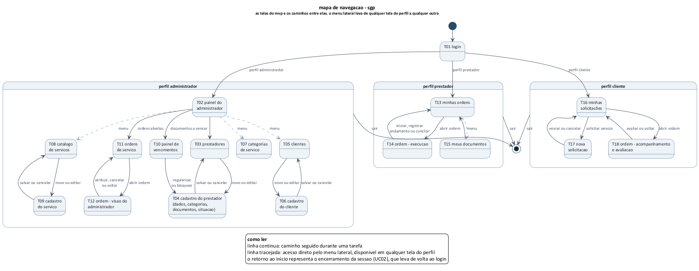

*fonte: elaborado pela equipe. arquivo fonte em [diagramas/mapa-de-navegacao.puml](../diagramas/mapa-de-navegacao.puml)*

o login é a unica porta de entrada, e o perfil da conta decide qual tela sera aberta depois dele. as tres areas nao se cruzam: nao existe caminho do prestador para uma tela do administrador, nem do cliente para a lista de prestadores.

no desenho, a linha continua é o caminho percorrido durante uma tarefa e a tracejada é o acesso direto pelo menu lateral, que fica disponivel em qualquer tela do perfil. o retorno ao inicio representa o encerramento da sessao (UC02), que acontece quando o usuario sai ou quando passam os 30 minutos de inatividade do RNF03.

---

## 7. prototipo de telas

### 7.1 como abrir

o prototipo esta na pasta `prototipos/`. basta abrir o arquivo [prototipos/index.html](../prototipos/index.html) com dois cliques: ele lista as 24 paginas e leva a qualquer uma delas.

nao é preciso instalar nada, nao ha dependencia de internet e nao existe passo de build. essa decisao foi tomada por causa da apresentacao: a demonstracao precisa funcionar mesmo sem rede na sala.

### 7.2 decisões de interface

a referencia visual nao foi painel de aplicativo, e sim a via de papel da ordem de servico e a ficha cadastral que o sistema vem substituir. quem usa isso passa o dia na tela, entre uma ligacao e outra, e precisa de informacao na tela, nao de espaco em branco bonito.

| decisao | por que |
|---|---|
| html e css escritos a mao, sem framework | o prototipo abre offline, e o mesmo html serve de referencia direta na hora de montar os componentes em react |
| navegacao real entre as telas, com links | o professor e a equipe percorrem o fluxo clicando, em vez de olhar imagens soltas |
| densidade alta, linha de tabela baixa e pouco espaco vago | o administrador compara varias ordens de uma vez. tela espacada obriga a rolar, e rolar atrapalha quem esta ao telefone |
| canto quase reto e nenhuma sombra | o desenho segue formulario impresso, nao cartao flutuante |
| situacao em etiqueta retangular, com a cor na borda esquerda | lembra a etiqueta de pasta de arquivo e se distingue do botao, que é a outra caixa clicavel da tela |
| numero alinhado pela direita, com digito de mesma largura | valor, prazo e quantidade ficam legiveis em coluna, como em planilha |
| a cor da marca so marca o que é clicavel | o chumbo de ferramenta e o laranja queimado de sinalizacao vem do mundo da manutencao predial. situacao usa outra escala, vermelho para vencido, ocre para a vencer, verde para concluido e cinza para o andamento da ordem, entao a marca nunca disputa atencao com o aviso |
| nenhum icone decorativo | o que informa é o texto e a situacao. icone sem funcao atrapalha a leitura em tabela densa |
| razao social em caixa alta, com o nome de tratamento embaixo | é assim que o dado chega do cadastro da receita, e é assim que o gestor reconhece o prestador |
| descricao escrita como o cliente escreve | o texto do pedido no prototipo foi escrito sem pontuacao caprichada de proposito. quem abre a ordem é o dono da padaria com pressa, nao um redator |
| dados ficticios coerentes entre as telas | o mesmo prestador, a mesma ordem e as mesmas datas aparecem em todas, entao o fluxo faz sentido ao ser demonstrado |
| a tela nao explica a si mesma | as observacões sobre cada tela ficam neste documento e como comentario no codigo, nao como texto na interface |

### 7.3 as telas

#### T01 - login

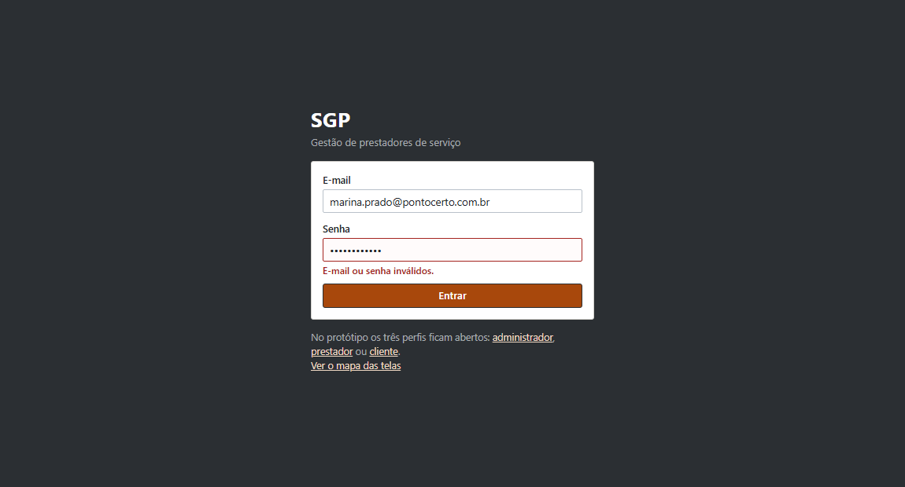

entrada unica do sistema. a mensagem de erro é proposital: informa que a credencial esta invalida sem dizer se o problema é o e-mail ou a senha, conforme o criterio de aceite da HU01. o bloco de baixo existe apenas no prototipo, para permitir a navegacao pelos tres perfis durante a demonstracao.

#### T02 - painel do administrador

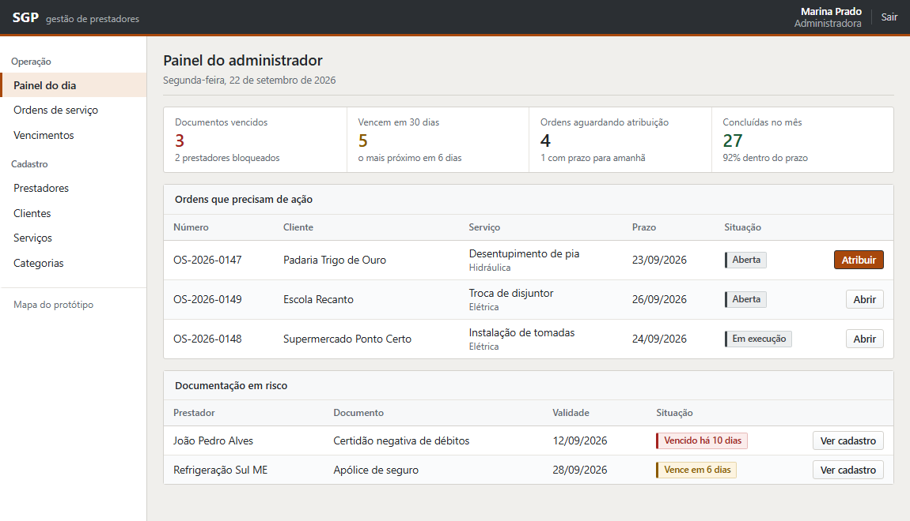

primeira tela de quem administra. responde em um olhar as duas perguntas do dia: o que esta vencendo e o que precisa ser atribuido. cada indicador leva direto para a listagem correspondente ja filtrada.

#### T03 - prestadores

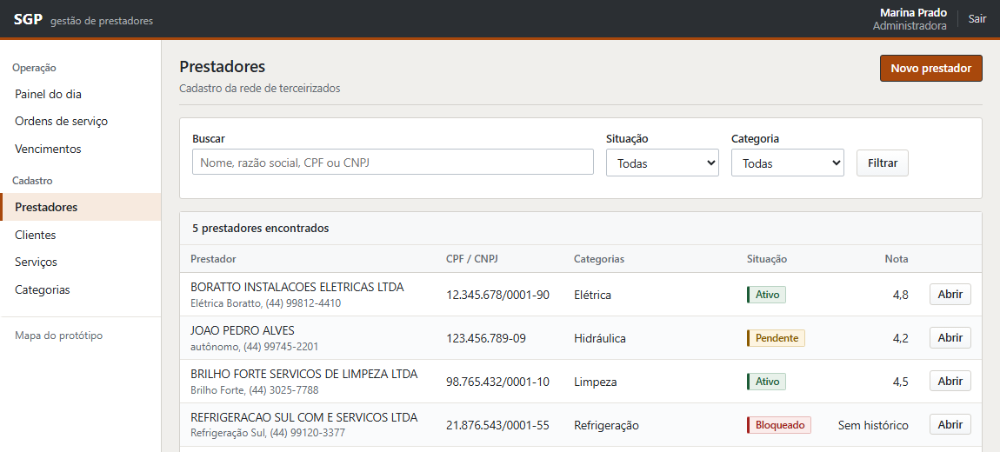

a rede de terceirizados que hoje vive em planilha. a situacao cadastral aparece como etiqueta colorida porque é ela que decide se o prestador pode ou nao receber servico.

#### T04 - cadastro do prestador

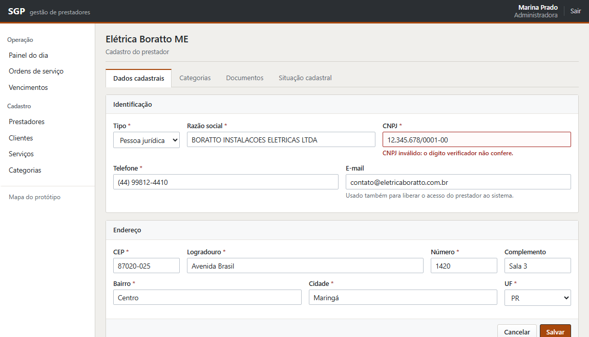

o cadastro é dividido em quatro abas: dados, categorias, documentos e situacao cadastral. a captura mostra a validacao do cnpj pelo digito verificador, exigida pela RN10: enquanto o campo estiver invalido, o formulario nao é enviado.

#### T10 - painel de vencimentos

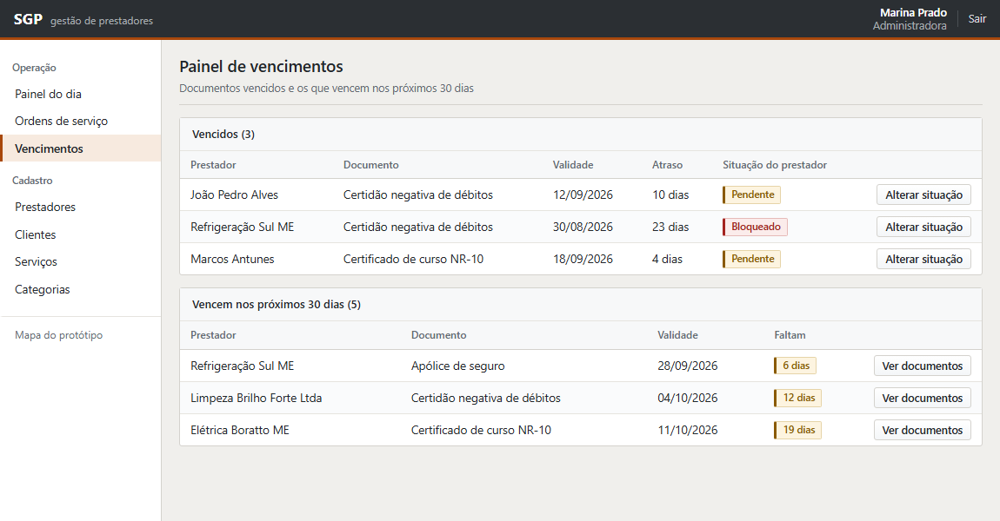

atende diretamente ao RF08. separa o que ja venceu do que vence nos proximos 30 dias, e permite alterar a situacao do prestador sem sair da tela, que é o relacionamento `<<extend>>` entre UC09 e UC11 do diagrama de casos de uso.

#### T11 - ordens de servico

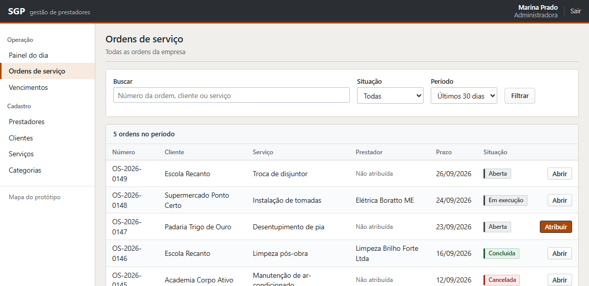

todas as ordens da empresa, com filtro por situacao e periodo. ordem cancelada continua na lista, com o motivo registrado, porque nada é excluido do historico.

#### T12 - ordem, visao do administrador

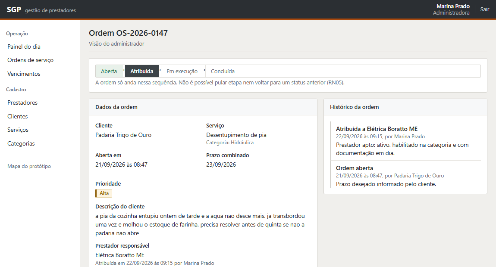

a trilha no topo mostra em que ponto da sequencia a ordem esta. a sequencia é a da RN05 e nao permite pular etapa nem voltar. ao lado fica o historico, que responde quem fez o que e quando.

#### T12 - atribuir prestador

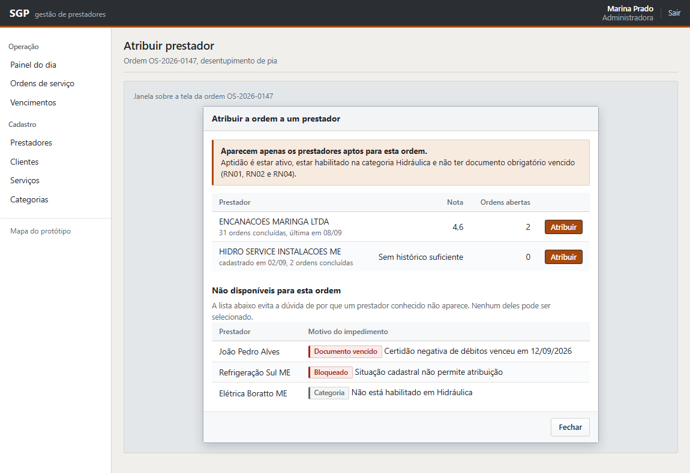

é a tela mais importante do sistema, e a que melhor mostra o valor do projeto. a lista de cima traz apenas quem esta apto. a lista de baixo mostra os demais **com o motivo do impedimento**, o que evita a duvida de por que um prestador conhecido nao aparece, sem permitir seleciona-lo.

#### T13 - minhas ordens (prestador)

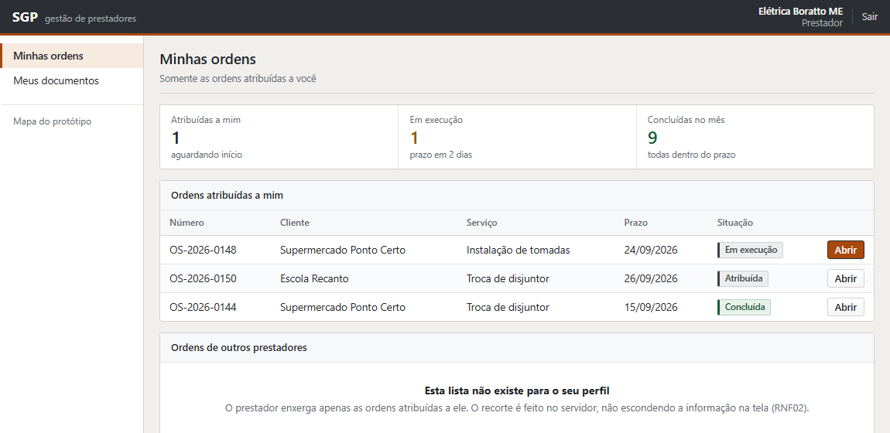

o prestador enxerga apenas o que foi atribuido a ele. o segundo bloco da tela registra explicitamente que a lista de ordens de outros prestadores nao existe para este perfil, e que o recorte é feito no servidor (RNF02).

#### T14 - execucao da ordem

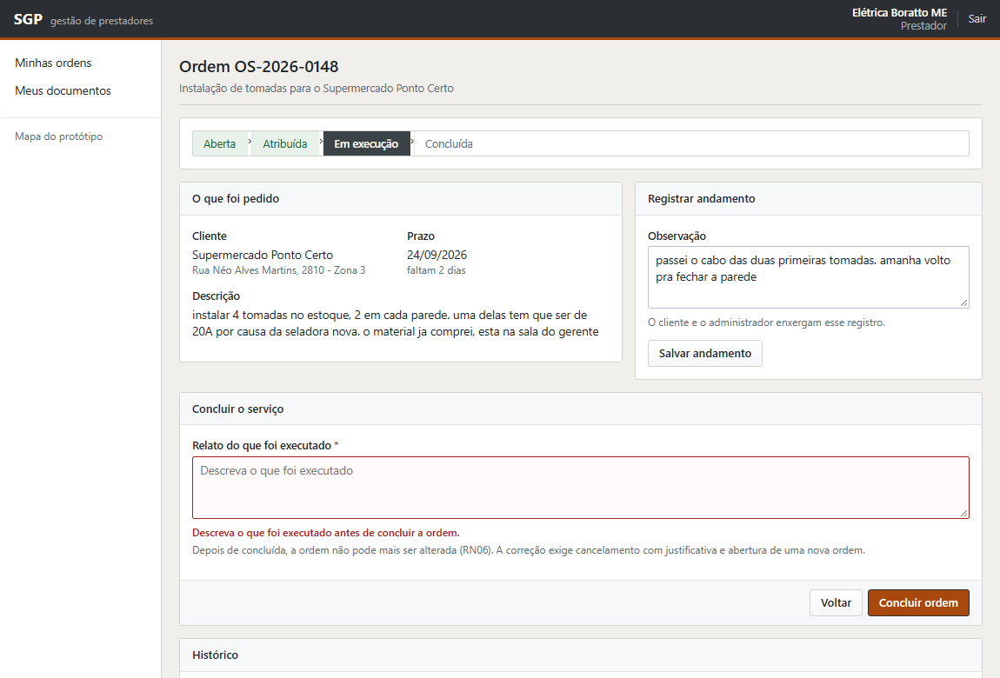

onde o servico acontece. o prestador registra o andamento durante o atendimento e conclui ao final. a conclusao exige o relato do que foi executado, e é nesse momento que o sistema compara a data com o prazo e marca a ordem como entregue no prazo ou em atraso (RN12).

#### T15 - meus documentos

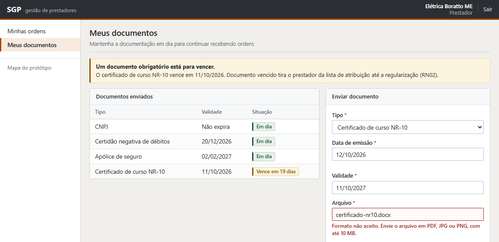

o prestador mantem a propria documentacao, sem depender de cobranca por mensagem. a captura mostra a recusa de um arquivo `.docx`, porque so sao aceitos pdf, jpg e png de ate 10 mb (RNF09).

#### T17 - nova solicitacao

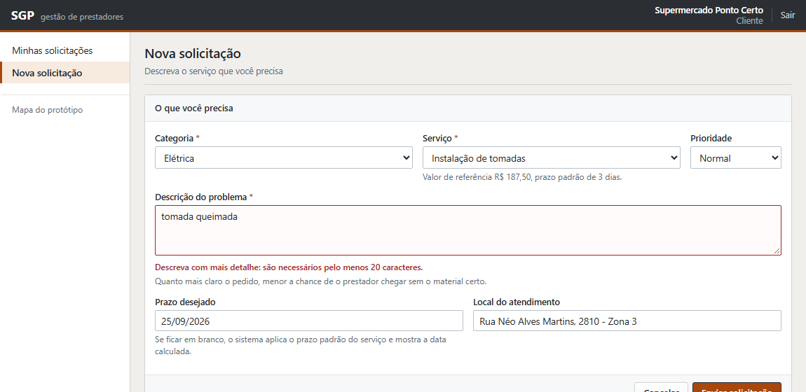

a abertura da ordem pelo cliente. a descricao exige um minimo de detalhe, e o prazo padrao do servico é aplicado quando o cliente nao informa uma data.

#### T18 - acompanhamento e avaliacao

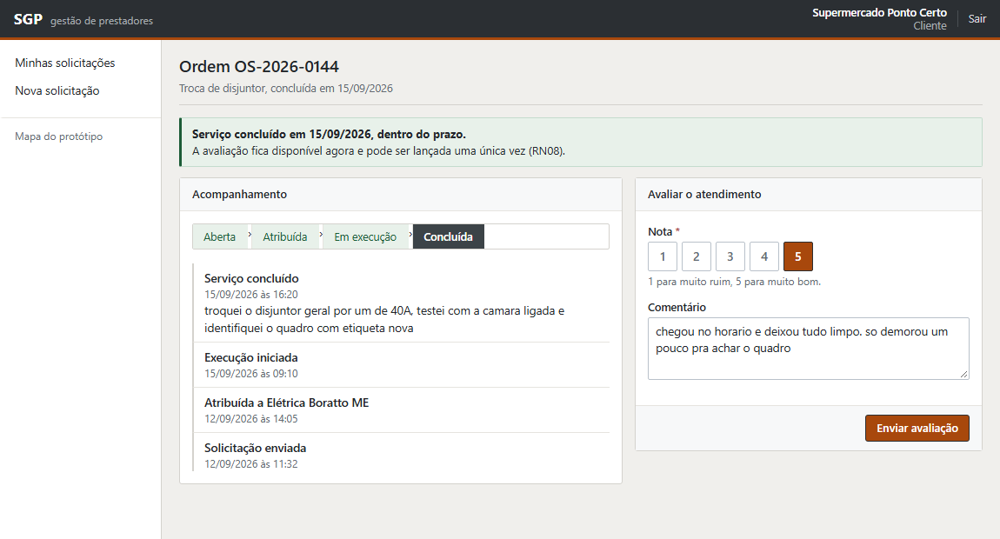

fecha o ciclo. o cliente acompanha o andamento pela linha do tempo e avalia o atendimento depois da conclusao. a avaliacao pode ser lancada uma unica vez, e apenas pelo cliente titular da ordem (RN08).

### 7.4 o que o prototipo representa alem do caminho feliz

o manual pede que o prototipo mostre validacao, feedback e estado vazio. cada um aparece em pelo menos uma tela:

| situacao | onde aparece |
|---|---|
| campo obrigatorio nao preenchido | T14, ao tentar concluir sem o relato do que foi executado |
| dado invalido | T04, com cnpj de digito verificador errado |
| texto abaixo do minimo exigido | T12 cancelar ordem, com motivo de menos de 10 caracteres, e T17, com descricao curta demais |
| arquivo em formato nao aceito | T15, com envio de `.docx` |
| credencial invalida | T01, sem revelar se o erro é no e-mail ou na senha |
| acao concluida com sucesso | T18, com o aviso de servico concluido dentro do prazo |
| alerta de risco | T02 e T15, com a documentacao proxima do vencimento |
| lista vazia por falta de permissao | T13, explicando que a lista de ordens de terceiros nao existe para o perfil |
| impedimento explicado | T12 atribuir, com o motivo de cada prestador inapto |

### 7.5 responsividade

o RNF04 exige que o sistema funcione em notebook de 1366x768 e em celular, sem rolagem horizontal. o prototipo foi conferido nas duas larguras: em tela estreita o menu lateral vira uma barra horizontal, os campos passam a ocupar a largura inteira e as tabelas se transformam em cartões, com o rotulo de cada coluna ao lado do valor.

---

## 8. rastreabilidade completa

a matriz abaixo fecha a cadeia: requisito, caso de uso, entidade, tela e mvp. ela é a resposta a pergunta "onde isso aparece no sistema?" para qualquer item levantado na 1ª entrega.

| requisito | caso de uso | entidades | tela | no mvp? |
|---|---|---|---|---|
| RF01 - autenticar usuario | UC01, UC02 | `usuario` | T01 | sim |
| RF02 - manter prestadores | UC03 | `prestador` | T03, T04 | sim |
| RF03 - manter clientes | UC04 | `cliente` | T05, T06 | sim |
| RF04 - manter categorias | UC05 | `categoria_servico` | T07 | sim |
| RF05 - manter catalogo | UC06 | `servico` | T08, T09 | sim |
| RF06 - habilitar em categorias | UC07 | `prestador_categoria` | T04 | sim |
| RF07 - enviar documentos | UC08 | `documento`, `tipo_documento` | T04, T15 | sim |
| RF08 - alertar vencimentos | UC09 | `documento`, `prestador` | T02, T10 | sim |
| RF09 - situacao cadastral | UC11 | `prestador`, `historico_situacao` | T04 | sim |
| RF10 - manter contratos | UC10 | `contrato` | nao tem tela no mvp | nao |
| RF11 - registrar ordem | UC12 | `ordem_servico` | T16, T17 | sim |
| RF12 - atribuir ordem | UC13, UC22 | `ordem_servico`, `prestador`, `prestador_categoria`, `documento` | T12 | sim |
| RF13 - acompanhar a ordem | UC15, UC16, UC17 | `ordem_servico`, `andamento_ordem` | T12, T14 | sim |
| RF14 - ordens do prestador | UC15, UC16 | `ordem_servico` | T13, T14 | sim |
| RF15 - avaliar atendimento | UC18 | `avaliacao` | T18 | sim |
| RF16 - consultar historico | UC19 | `ordem_servico`, `avaliacao` | listagens com filtro (T11, T13, T16) | parcial |
| RF17 - relatorio de desempenho | UC20 | `ordem_servico`, `avaliacao` | nao tem tela no mvp | nao |
| RF18 - relatorio por periodo | UC21 | `ordem_servico`, `servico` | nao tem tela no mvp | nao |
| RF19 - log de acões criticas | UC23 | `log_acao` | nao tem tela, é gravacao interna | nao |

**cobertura:** os 15 requisitos funcionais do mvp tem tela correspondente. os quatro que ficaram de fora estao documentados na secao 3.2, com a justificativa de cada um.

---

## 9. proximos passos

| etapa | o que sera feito | quando |
|---|---|---|
| release 1 - base | autenticacao e cadastros de apoio, com as telas T01 a T09 | primeira semana da implementacao |
| release 2 - documentacao | documentos, vencimentos e situacao cadastral, com as telas T10 e T15 | segunda semana |
| release 3 - operacao | ordem de servico do pedido a avaliacao, com as telas T11 a T14, T16 a T18. **fim do mvp** | terceira semana |
| release 4 - complementos | contratos, aceite da atribuicao, historico consolidado, relatorio e log | se houver folga no cronograma |

o quadro de tarefas com responsavel e situacao esta em [backlog.md](backlog.md), e é o documento que a equipe atualiza durante a construcao.

---

## 10. referencias

- manual da 3ª entrega - imersao profissional, projeto de software. unicesumar, 2026.
- sgp - documento de visao e requisitos, versao 1.0, equipe 8.
- sgp - documento de casos de uso, historias de usuario e priorizacao, versao 1.1, equipe 8.
- sgp - diagrama de classes, modelo de dados e dicionario de dados, versao 1.0, equipe 8.
- nielsen, j. *usability engineering*. academic press, 1993. (estados de erro, feedback e visibilidade do status do sistema)
- clegg, d.; barker, r. *case method fast-track: a rad approach*. addison-wesley, 1994. (tecnica moscow)

---

## historico de alteracões

| versao | data | alteracao |
|---|---|---|
| 1.0 | 22/09/2026 | primeira versao, com a definicao do mvp, o fluxo completo, o levantamento de telas, o mapa de navegacao, o prototipo e a rastreabilidade ampliada |
