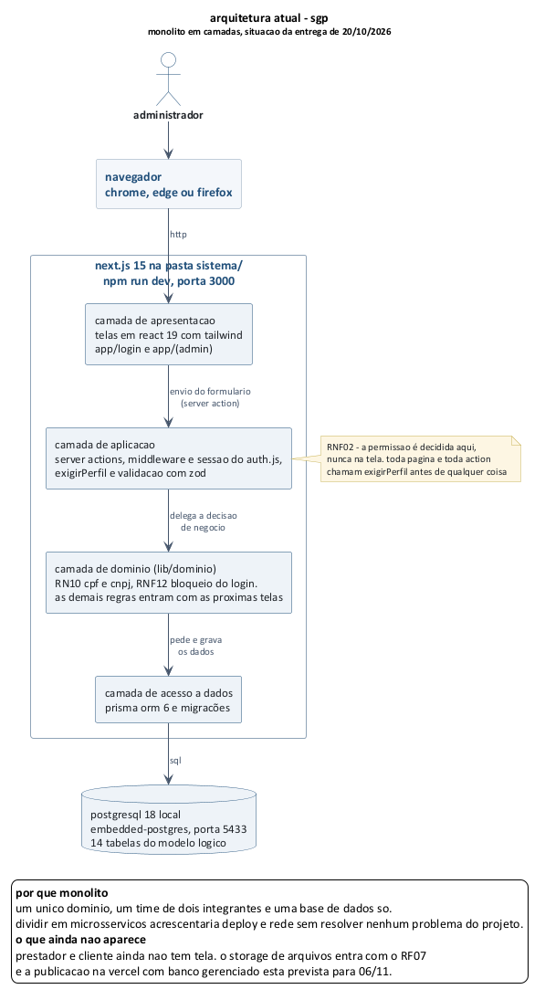

# sgp - sistema de gestao de prestadores
## especificacao de tecnologias e arquitetura

**versao 1.1 - 06/10/2026 - 1ª entrega do 2º bimestre (20/10)**
unicesumar - analise e desenvolvimento de sistemas
imersao profissional - projeto de software - equipe 8

---

## 1. objetivo

na 1ª entrega a equipe registrou a stack em nivel de intencao: next.js, node, postgresql e vercel. este documento fecha essa definicao, informando exatamente qual biblioteca sera usada em cada responsabilidade, por que ela foi escolhida, qual alternativa foi descartada e a qual requisito nao funcional a escolha responde. o objetivo é que, ao iniciar a codificacao na 3ª entrega, nenhuma decisao estrutural precise ser tomada no meio do caminho.

---

## 2. criterios de escolha

toda escolha desta secao foi avaliada por quatro criterios, nesta ordem:

| criterio | o que significa na pratica |
|---|---|
| **custo zero** | precisa ter plano gratuito suficiente para o volume de dados de teste do trabalho. o projeto nao tem orcamento |
| **familiaridade da equipe** | com dois integrantes e um bimestre, nao ha folga para aprender uma tecnologia nova do zero no caminho critico |
| **atendimento aos RNF** | a escolha precisa ajudar a cumprir um requisito nao funcional do documento de visao, e nao criar trabalho extra para cumpri-lo |
| **facilidade de entrega e demonstracao** | o professor precisa conseguir abrir o sistema por um link, sem instalar nada |

---

## 3. stack definida

### 3.1 quadro geral

| camada | tecnologia | versao em uso (20/10) | responsabilidade no sgp |
|---|---|---|---|
| linguagem | typescript | 5.x | tipagem estatica no front e no back, com o mesmo tipo compartilhado entre os dois |
| framework web | next.js (app router) | 15.5 | renderizacao das telas e hospedagem das rotas de api no mesmo projeto |
| biblioteca de interface | react | 19.1 | componentes das telas |
| estilo | tailwind css | 4. o shadcn/ui ficou pra quando houver dialogo de confirmacao (ver 3.3) | layout responsivo das telas, com as cores do prototipo |
| runtime do servidor | node.js | 20 ou superior, testado no 22 | execucao das rotas de api do proprio next |
| acesso a dados | prisma orm | 6.19 | mapeamento objeto-relacional, migracões versionadas e tipagem do banco |
| banco de dados | postgresql | 18 no ambiente local. o gerenciado sera escolhido ate 06/11 | persistencia |
| autenticacao | auth.js (next-auth) v5, estrategia credentials | 5.0 beta 32 | login por email e senha, sessao em cookie httponly e controle de perfil |
| hash de senha | bcryptjs | 3.0 | armazenamento da senha conforme RNF01 |
| validacao | zod | 3.25 | validacao dos dados no cliente e no servidor a partir do mesmo esquema |
| armazenamento de arquivos | storage de objetos do proprio provedor do banco | ainda nao usado, entra com o RF07 | documentos e contratos em pdf, jpg e png |
| hospedagem | vercel | plano hobby, a partir de 06/11 | publicacao continua a cada push na branch principal |
| versionamento | git + github | - | repositorio unico, com commits identificaveis por integrante (RNF11) |
| testes | vitest (unidade) e playwright (fluxo) | vitest 5. os fluxos estao em casos manuais documentados no testes.md, o playwright entra depois | verificacao das regras de negocio e dos fluxos criticos |
| modelagem | plantuml | 1.2026 | diagramas versionados como texto junto do codigo |

### 3.2 justificativa por escolha

| escolha | por que | alternativa considerada | por que nao |
|---|---|---|---|
| **next.js com app router** | um unico projeto entrega a interface e a api, o que reduz configuracao, deploy e tempo de setup. é o framework com que a equipe ja trabalhou | react puro com api separada em express | dois projetos, dois deploys e configuracao de cors, sem ganho para o porte deste sistema |
| **typescript** | erro de tipo aparece na hora da escrita e nao no teste. com duas pessoas mexendo no mesmo codigo, isso evita retrabalho | javascript | perde a checagem em um dominio com varias entidades e status |
| **prisma** | migracões versionadas em arquivo, que é o que permite reconstruir o banco identico no computador dos dois integrantes. o schema tambem serve como documentacao viva do modelo logico | sql escrito na mao com driver `pg` | mais controle, mas custa tempo em algo que nao é o foco da avaliacao |
| **postgresql** | é o banco pedido na disciplina, tem tipos adequados (data, numerico, enum) e restricao de unicidade nativa para atender a RN10 | mysql | atenderia, mas postgresql é o padrao adotado nas demais materias do curso |
| **auth.js com credentials** | resolve sessao, cookie e expiracao sem escrever isso do zero, e a estrategia credentials é a que corresponde ao RF01 (email e senha) | jwt implementado manualmente | implementar sessao segura na mao é justamente onde erro de seguranca costuma aparecer |
| **tailwind + shadcn/ui** | componentes acessiveis e responsivos prontos, o que ajuda a cumprir o RNF04 sem gastar o prazo escrevendo css | bootstrap | funciona, mas os componentes ficam com aparencia generica e a customizacao é mais trabalhosa |
| **zod** | o mesmo esquema valida no formulario e na rota de api, o que garante o RNF02 sem duplicar regra | validacao so no formulario | deixaria a api aceitando requisicao manipulada, violando o RNF02 |
| **vercel** | deploy automatico a cada push, url publica para o professor e integracao direta com o next.js | render, railway | atendem, mas exigem mais configuracao e o plano gratuito hiberna o servico |

### 3.3 ajustes feitos ao comecar a implementacao (versao 1.1)

na hora de escrever o codigo algumas escolhas da versao 1.0 mudaram. nenhuma mexe no estilo da arquitetura nem nos requisitos, sao ajustes de ferramenta.

| o que estava previsto | o que foi feito | por que |
|---|---|---|
| postgresql local em docker | pacote `embedded-postgres`, que sobe o postgres com `npm run banco` | nenhum dos dois integrantes tem docker instalado. o pacote baixa o postgres junto com o `npm install` e funciona igual no windows dos dois |
| `bcrypt` | `bcryptjs` | mesmo algoritmo e mesmo custo 10, so que escrito em javascript. o `bcrypt` precisa compilar codigo nativo no windows, o que costuma falhar na instalacao |
| rotas de api em `/app/api` | server actions do next nas telas | a action ja roda no servidor e evita escrever uma rota e um fetch pra cada formulario. o RNF02 continua igual: a primeira linha de toda action é `exigirPerfil`. a unica rota de api é a do proprio auth.js |
| shadcn/ui | tailwind puro, com as cores do `prototipos/estilo.css` | as telas ja estavam desenhadas no prototipo e os componentes do shadcn teriam que ser repintados. ele volta a ser avaliado quando entrar o primeiro dialogo de confirmacao (RNF05) |
| codigo na raiz do repositorio | pasta `sistema/` | a raiz publica a documentacao e o prototipo. separar evita misturar as duas coisas |
| primeiro deploy junto com o projeto | deploy em 06/11 | publicar exige o banco gerenciado, e essa escolha ja estava em aberto na secao 8 |

---

## 4. arquitetura da aplicacao

### 4.1 estilo arquitetural

o desenho abaixo é o alvo do projeto inteiro. o que ja existe hoje no codigo esta no diagrama atualizado, logo depois.

o sgp segue uma arquitetura **monolitica em camadas**, publicada como aplicacao unica. a separacao em microsservicos foi descartada por nao haver ganho: o sistema tem um unico dominio, um unico time e uma base de dados so.

```
   navegador (chrome, edge, firefox)
             |
             | https
             v
+---------------------------------------------+
|  next.js na vercel                          |
|                                             |
|  camada de apresentacao                     |
|  telas em react, componentes shadcn/ui      |
|                                             |
|  camada de aplicacao                        |
|  rotas de api, autorizacao por perfil,      |
|  validacao com zod                          |
|                                             |
|  camada de dominio                          |
|  regras RN01 a RN12, maquina de estado      |
|  da ordem de servico                        |
|                                             |
|  camada de acesso a dados                   |
|  prisma orm                                 |
+---------------------------------------------+
        |                        |
        v                        v
+----------------+     +----------------------+
|  postgresql    |     |  storage de objetos  |
|  dados         |     |  documentos e        |
|  transacionais |     |  contratos           |
+----------------+     +----------------------+
```



### 4.2 responsabilidade de cada camada

| camada | o que fica aqui | o que nao pode ficar aqui |
|---|---|---|
| apresentacao | telas, formularios, mascaras de cpf e cnpj, exibicao de mensagem | regra de negocio e decisao de permissao |
| aplicacao | recebimento da requisicao, verificacao do perfil, validacao de entrada, orquestracao | consulta sql direta |
| dominio | as 12 regras de negocio, a transicao de status da ordem, o calculo da nota media e do atraso | detalhe de banco ou de framework |
| acesso a dados | consultas, transacões e migracões | regra de negocio |

a regra que sustenta essa divisao é o RNF02: **nenhuma permissao é decidida na tela**. esconder o botao é so conforto visual. a rota de api verifica o perfil e a titularidade do registro antes de qualquer operacao, e recusa a requisicao quando o perfil nao tem direito, mesmo que ela tenha sido montada fora da interface.

### 4.3 onde cada caso de uso critico é implementado

| caso de uso | ponto de implementacao |
|---|---|
| UC01 - autenticar | provider credentials do auth.js, com comparacao de hash bcrypt |
| UC22 - verificar aptidao | funcao unica na camada de dominio, chamada pela rota de atribuicao. concentra RN01 a RN04 em um lugar so |
| UC13 - atribuir ordem | transacao no banco: revalida a aptidao, grava o status e grava o log em uma operacao unica, para evitar atribuicao duplicada |
| UC15, UC16 - andamento e conclusao | maquina de estado da ordem, que recusa qualquer transicao fora da sequencia definida na RN05 |
| UC23 - log | tabela sem rota de alteracao nem de exclusao. gravacao apenas por insercao |

---

## 5. como cada requisito nao funcional é atendido

| RNF | requisito | como sera atendido |
|---|---|---|
| RNF01 | senha em hash | bcrypt com fator de custo 10 na criacao e na troca de senha. a coluna guarda apenas o hash |
| RNF02 | permissao validada no servidor | verificacao de perfil e de titularidade em toda rota de api, com esquema zod na entrada |
| RNF03 | sessao expira em 30 minutos | `maxAge` da sessao do auth.js configurado em 1800 segundos, renovado a cada requisicao valida |
| RNF04 | interface responsiva | tailwind com layout fluido, testado em 1366x768 e em largura de celular, sem rolagem horizontal |
| RNF05 | confirmacao e mensagem de retorno | dialogo de confirmacao do shadcn/ui em toda acao destrutiva e notificacao de sucesso ou erro apos cada operacao |
| RNF06 | listagem paginada em ate 3 segundos com 5 mil registros | paginacao no banco (`limit` e `offset`), indice nas colunas de filtro e carga de dados ficticios para medir o tempo |
| RNF07 | compatibilidade com chrome, edge e firefox | uso apenas de recursos suportados pelas versões atuais dos tres, sem api experimental |
| RNF08 | hospedagem em nuvem com backup diario | instancia gerenciada de postgresql com backup automatico diario incluido no plano gratuito |
| RNF09 | upload de pdf, jpg e png ate 10 mb | validacao de tipo mime e de tamanho na rota de upload, antes de enviar ao storage |
| RNF10 | privacidade e lgpd | dados pessoais visiveis apenas ao perfil autorizado, base de teste com dados ficticios e rotina de anonimizacao do cadastro mediante solicitacao |
| RNF11 | codigo versionado com padrao | repositorio no github, branch por funcionalidade, commits no padrao `tipo: descricao` e readme atualizado a cada entrega |

---

## 6. organizacao do repositorio

```
/docs                     documentacao das entregas (este arquivo, testes, backlog...)
/diagramas                fontes .puml e imagens geradas
/prototipos               telas da 3a entrega do 1º bimestre
/ferramentas              scripts python que geram o html dos documentos e o prototipo
/sistema                  o codigo do sgp
  /app
    /login                tela de login e a action de entrar
    /(admin)              telas do administrador, com o layout que confere o perfil
      /prestadores        lista, novo, edicao e a action de salvar
    /api/auth             rota do auth.js
  /lib
    /dominio              regras de negocio (RN10, RNF12...) e os testes delas
    /validacao            esquemas zod
    db.ts                 cliente prisma
    permissao.ts          exigirPerfil
  /prisma
    schema.prisma         modelo de dados
    /migrations           migracões versionadas
    seed.ts               carga inicial
  /scripts/banco.mjs      sobe o postgres local
  auth.ts, auth.config.ts, middleware.ts   configuracao do login e da sessao
```

as pastas `(prestador)` e `(cliente)` previstas na versao 1.0 entram quando as telas desses perfis forem feitas.

---

## 7. ambiente de desenvolvimento

| item | definicao |
|---|---|
| editor | vs code, com extensões de eslint, prettier e prisma |
| gerenciador de pacotes | npm |
| banco local | postgresql pelo `embedded-postgres` (`npm run banco`), sem docker e sem instalar nada a parte |
| variaveis de ambiente | arquivo `.env` dentro de `sistema/`, fora do versionamento. o repositorio guarda apenas o `.env.example`, com os nomes e sem segredo |
| fluxo de trabalho | commits pequenos citando a tarefa do backlog. branch por funcionalidade e pull request quando os dois estiverem mexendo no codigo ao mesmo tempo |
| publicacao | na vercel a partir de 06/11 |

---

## 8. decisões ainda em aberto

as definicões abaixo nao bloquearam o inicio do desenvolvimento. a do banco gerenciado agora tem data, porque a publicacao depende dela.

| item | opcões em avaliacao | quando decidir |
|---|---|---|
| provedor do postgresql gerenciado | neon ou supabase | ate 06/11, junto com a definicao do storage, porque a escolha do banco arrasta o storage |
| storage dos documentos | vercel blob ou storage do supabase | mesmo momento acima |
| geracao do pdf do relatorio (UC24) | biblioteca no servidor ou impressao pelo navegador | apenas se UC24 sair do backlog |
| biblioteca de grafico no relatorio | recharts ou tabela simples sem grafico | na construcao do UC20 |

---

## 9. riscos tecnicos

| risco | impacto | como a equipe pretende tratar |
|---|---|---|
| limite do plano gratuito de storage ou de banco | alto | volume de teste controlado, com no maximo alguns megabytes de arquivo por prestador |
| hibernacao da instancia gratuita do banco | medio | acessar o sistema antes de qualquer apresentacao, para a primeira requisicao nao pegar o banco frio |
| a equipe nunca usou auth.js v5 | medio | implementar a autenticacao logo na release 1, quando ainda ha prazo para trocar de abordagem |
| indisponibilidade de um integrante | alto | commits pequenos e frequentes, e nenhuma parte do sistema conhecida por apenas uma pessoa |

---

## 10. referencias

- sgp - documento de visao e requisitos, versao 1.0, equipe 8, 14/08/2026.
- sgp - documento de casos de uso, historias de usuario e priorizacao, versao 1.0, equipe 8, 21/08/2026.
- sommerville, i. *engenharia de software*. 10. ed. sao paulo: pearson, 2018.
- documentacao oficial do next.js, prisma, auth.js e tailwind css, consultada em agosto de 2026.

---

## historico de alteracões

| versao | data | alteracao |
|---|---|---|
| 1.0 | 21/08/2026 | primeira versao, detalhando a stack que estava indicada apenas em nivel de intencao na 1ª entrega |
| 1.1 | 06/10/2026 | versões reais em uso, ajustes da secao 3.3, diagrama da arquitetura atual e organizacao real das pastas |
